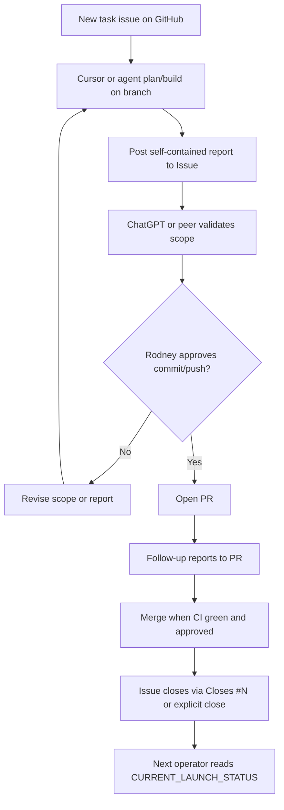

# 24/7 Launch Operations Handoff

**Day 15 — docs-only launch operations continuity (Issue #36)**

Makes **GitHub** the operating centre for Wayfinder launch operations so ChatGPT, Cursor, Claude, Claude Code, Codex, OpenClaw, and future agents/operators can continue monitoring, triage, and handoff with **minimal Rodney involvement**.

**Does not change app runtime, workflows, or UI.**

Read first:

- [docs/CURRENT_LAUNCH_STATUS.md](./CURRENT_LAUNCH_STATUS.md)
- [docs/LAUNCH_CANDIDATE_SIGN_OFF.md](./LAUNCH_CANDIDATE_SIGN_OFF.md)
- [docs/LAUNCH_FREEZE_GO_NO_GO_PROTOCOL.md](./LAUNCH_FREEZE_GO_NO_GO_PROTOCOL.md)
- [docs/LAUNCH_OPERATOR_RUNBOOK.md](./LAUNCH_OPERATOR_RUNBOOK.md)
- [docs/LAUNCH_READINESS_EVIDENCE_PACK.md](./LAUNCH_READINESS_EVIDENCE_PACK.md)
- GitHub [Issue #28](https://github.com/rodtay72/wayfinder-app/issues/28) — recurring production smoke reminder (**keep open**)

**Production:** [https://wayfinder-modular.vercel.app](https://wayfinder-modular.vercel.app)

**Repo:** `rodtay72/wayfinder-app`

**Last updated:** 2026-06-19

---

## Wayfinder canon (non-negotiable)

Wayfinder is **not** child diagnosis, child profiling, parent scoring, or Behaviour → Advice.

Core pathway:

```
Behaviour → Need → Parent CAB → Alignment Check → Awareness → Growth → Navigate / Next Action
```

Use cautious language: **may**, **might**, **possible**, **let's explore**.

---

## 1. 24/7 operating principle

| Principle | Rule |
|-----------|------|
| **GitHub is the operating centre** | Issues, PRs, and issue/PR comments are the source of operational continuity — not chat-only context |
| **Self-contained reports** | Every task must leave a report the next operator can act on without re-asking Rodney |
| **Reduce owner load** | Reports exist so the next agent/operator can continue safely with minimal Rodney involvement |
| **Production safety first** | Launch freeze, smoke evidence, and stop conditions outrank speed or convenience |
| **No invented evidence** | Record only what is verified; do not mark Pass/Confirmed without owner confirmation where required |

Supported platforms (same rules apply to all):

- ChatGPT
- Cursor
- Claude / Claude Code
- Codex
- OpenClaw
- Future agents and human operators

**Launch candidate baseline:** Production on `main` after Day 14 (PR #35). Acceptance remains **conditional** on [Issue #28](https://github.com/rodtay72/wayfinder-app/issues/28) public heartbeat and owner manual authenticated smoke remaining clear — see [LAUNCH_CANDIDATE_SIGN_OFF.md](./LAUNCH_CANDIDATE_SIGN_OFF.md).

---

## 2. Always-post-report rule

Every task **must** end with a self-contained report posted to GitHub.

| Phase | Post report to |
|-------|----------------|
| **Before PR exists** | The GitHub **Issue** (plan/build report) |
| **After PR exists** | The **PR** (follow-up, fix, check, or merge-readiness report) |
| **After merge** | Issue closes automatically when PR uses `Closes #issue`; otherwise record completion in issue comment and close explicitly |

### Report file convention

For build/plan tasks, create a self-contained markdown file in repo root when instructed (e.g. `report-issue36.md`), then post:

```powershell
& "C:\Program Files\GitHub CLI\gh.exe" issue comment <N> --repo rodtay72/wayfinder-app --body-file report-issue<N>.md
```

Or post equivalent content directly as an issue/PR comment.

### Report quality rules

- Self-contained — next operator needs no prior chat history
- No PII — no parent emails, Supabase UUIDs, child names, JWTs, tokens, secrets, or reflection content
- Exact files changed — not summaries only
- Honest blocker/uncertainty flags — do not hide human decisions required

**Do not commit report files** unless explicitly instructed. **Do not push** until Rodney approves.

---

## 3. Standard report fields

Use this checklist in every plan/build, follow-up, or merge-readiness report:

| Field | Required content |
|-------|------------------|
| **branch** | Exact branch name |
| **issue / PR number** | e.g. Issue #36, PR #37 |
| **purpose** | What this task accomplished |
| **files read** | Key docs/files consulted |
| **exact files changed** | Full paths; new vs modified |
| **checks run** | Commands executed |
| **check results** | Pass/fail per check |
| **safety confirmation** | Docs-only / scope respected / ALIGN canon preserved |
| **forbidden files untouched** | Confirm no workflow, runtime, auth, journal, config touches |
| **auth / RLS / journal / dashboard / privacy / deployment impact** | None expected, or describe if blocker fix |
| **Issue #28 status** | When production smoke relevant: **keep open**; heartbeat vs manual smoke distinction |
| **previous day / PR status** | e.g. Day 14 / PR #35 complete |
| **blocker / uncertainty / human decision required** | Yes/no with detail |
| **commit status** | Done / not done |
| **push status** | Done / not done |
| **approval status** | Rodney approval needed before commit/push/merge |
| **recommended next action** | One clear step for the next operator/agent |

### Example report skeleton

```markdown
## Build report — Issue #N

**Branch:** docs/example-branch
**Issue:** #N
**Purpose:** ...

### Files read
- docs/CURRENT_LAUNCH_STATUS.md
- ...

### Exact files changed
- docs/EXAMPLE.md (new)
- docs/CURRENT_LAUNCH_STATUS.md (updated)

### Checks run / results
| Check | Result |
|-------|--------|
| git diff --name-only | pass — docs only |
| git diff --check | pass |
| node --check supabase.js | pass |

### Safety confirmation
Docs-only; ALIGN/CAB preserved; no forbidden files touched.

### Auth / RLS / journal / dashboard / privacy / deployment impact
None — docs-only.

### Issue #28
Remains open — recurring production smoke reminder.

### Previous day / PR status
Day 14 / PR #35 marked complete in CURRENT_LAUNCH_STATUS.

### Blockers / uncertainties
None / [describe]

### Commit / push
Not done / Done

### Approval needed
Yes — Rodney review before commit and push.

### Recommended next action
[Next operator step]
```

---

## 4. Launch freeze continuation

Launch freeze remains **active** — see [LAUNCH_FREEZE_GO_NO_GO_PROTOCOL.md](./LAUNCH_FREEZE_GO_NO_GO_PROTOCOL.md).

### Forbidden during freeze (unless explicitly approved)

- New features, UI polish, research tooling, AI implementation, questionnaire implementation, schema work, runtime refactors
- Deployment or Vercel/Supabase config changes
- Workflow behaviour changes (`.github/workflows/*`)
- Package/build-system migrations

### Allowed during freeze

- **Production blockers only** — auth, journal save/read, dashboard loading, privacy leak, deployment failure, data safety
- **Docs evidence updates** — launch status, evidence pack, runbook, protocol, sign-off, this handoff
- **Smoke evidence recording** — owner-confirmed only
- **Critical safety fixes** — minimal diff; owner merge; full manual smoke after merge

### Ongoing rules

- **[Issue #28 stays open](https://github.com/rodtay72/wayfinder-app/issues/28)** — recurring `production-watch` reminder; do **not** close
- Public heartbeat ≠ authenticated manual smoke — both tracked separately
- Launch candidate conditional acceptance — see [LAUNCH_CANDIDATE_SIGN_OFF.md](./LAUNCH_CANDIDATE_SIGN_OFF.md)
- One branch, one merge at a time
- **No App Version entry** unless user-facing behaviour actually changed

---

## 5. Agent handoff workflow



### Handoff consistency rules

| Item | Rule |
|------|------|
| **Branch names** | Match issue scope — e.g. `docs/24-7-launch-operations-handoff` for Issue #36 |
| **Reports** | Same standard fields (§3) every time |
| **PR bodies** | Use `.github/PULL_REQUEST_TEMPLATE.md`; reference issue |
| **Issue comments** | Self-contained; link branch and changed files |
| **Duplicate issues** | Clean up immediately — one issue per task |
| **Launch status** | Update [CURRENT_LAUNCH_STATUS.md](./CURRENT_LAUNCH_STATUS.md) after merge |

### Platform handoff (OpenClaw and others)

OpenClaw webhook socialisation remains **deferred**. Until configured:

- Copy report content manually between platforms
- GitHub issue/PR comment is still the **canonical** record
- Do not paste secrets, tokens, or PII across platforms

### Operator rhythm during freeze

Follow daily SGT rhythm in [LAUNCH_FREEZE_GO_NO_GO_PROTOCOL.md](./LAUNCH_FREEZE_GO_NO_GO_PROTOCOL.md) §3 and [LAUNCH_OPERATOR_RUNBOOK.md](./LAUNCH_OPERATOR_RUNBOOK.md) §20.

---

## 6. Stop conditions

Stop work, pause merges, and escalate to Rodney when:

- Any **auth, RLS, or email verification** blocker
- **Parent ID / Child ID** integrity broken
- **Journal save/read** or Journal Trail broken
- **Dashboard loading** broken for verified users
- **Privacy masking** failure in normal UI
- **Deployment** / production URL down (Issue #28 heartbeat **Failed** with prolonged outage)
- **Production monitoring false confidence** — treating heartbeat as full authenticated smoke
- **Data safety** uncertainty or open P0 production incident
- Evidence would require **inventing** manual results
- **ALIGN/CAB or PDPA canon** would be weakened
- **Freeze violated** without approval
- **Issue #28 closed** without owner approval
- Request touches **forbidden files** without explicit issue allowlist

When stopped: update evidence pack if smoke-related, post stop report to issue/PR, do not commit/push until owner resolves.

---

## Related docs

- [CURRENT_LAUNCH_STATUS.md](./CURRENT_LAUNCH_STATUS.md)
- [LAUNCH_CANDIDATE_SIGN_OFF.md](./LAUNCH_CANDIDATE_SIGN_OFF.md) — Day 14 / PR #35
- [LAUNCH_FREEZE_GO_NO_GO_PROTOCOL.md](./LAUNCH_FREEZE_GO_NO_GO_PROTOCOL.md)
- [LAUNCH_OPERATOR_RUNBOOK.md](./LAUNCH_OPERATOR_RUNBOOK.md)
- [LAUNCH_READINESS_EVIDENCE_PACK.md](./LAUNCH_READINESS_EVIDENCE_PACK.md)
- [PLATFORM_SYNC_PRODUCTION_OPS.md](./PLATFORM_SYNC_PRODUCTION_OPS.md)
- [AGENT_HANDOFF_BRIEF.md](./AGENT_HANDOFF_BRIEF.md)
- GitHub [Issue #28](https://github.com/rodtay72/wayfinder-app/issues/28) — **keep open**
- GitHub [Issue #36](https://github.com/rodtay72/wayfinder-app/issues/36) — Day 15 24/7 handoff
