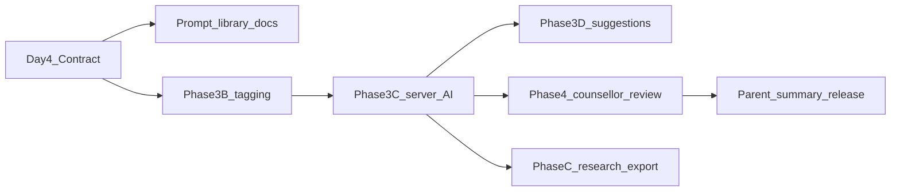

# AI Congruence Analysis Contract

## Status

**Day 4 — docs-only research architecture**

This document defines the contract for future AI-assisted congruence analysis in Wayfinder. It is **planning and governance only**. It does **not** authorise AI calls, schema changes, API changes, Supabase edits, auth changes, prompt deployment, or new product features.

Read first:

- [AGENTS.md](../AGENTS.md)
- [docs/WAYFINDER_ALIGN_PRODUCT_CANON.md](./WAYFINDER_ALIGN_PRODUCT_CANON.md)
- [docs/RESEARCH_AI_CAPABILITY_MAP.md](./RESEARCH_AI_CAPABILITY_MAP.md)
- [docs/ACTIVITY_PRACTICE_TAXONOMY.md](./ACTIVITY_PRACTICE_TAXONOMY.md)
- [docs/QUESTIONNAIRE_MEASURES_FRAMEWORK.md](./QUESTIONNAIRE_MEASURES_FRAMEWORK.md)
- [docs/WAYFINDER_AGENT_OPERATING_SYSTEM.md](./WAYFINDER_AGENT_OPERATING_SYSTEM.md)
- [docs/WAYFINDER_PHASE_3_AI_REFLECTIVE_EVIDENCE_LAYER_PLAN.md](./WAYFINDER_PHASE_3_AI_REFLECTIVE_EVIDENCE_LAYER_PLAN.md)
- [docs/ai-prompt-safety-review.md](./ai-prompt-safety-review.md)

---

## Non-negotiable framing

Wayfinder is **not**:

- child diagnosis or labelling
- parent scoring, ranking, or fixed parent typing
- stage completion or “relationship fixed/solved” tracking
- a Behaviour → Advice parenting tool
- a clinical assessment or therapy substitute

Wayfinder **is** a parent emotional development pathway using ALIGN/CAB:

Behaviour → Need → Parent CAB → Alignment Check → Awareness → Growth → Navigate / Next Action

**Congruence** in this contract means an exploratory comparison between a **possible emerging child need** and the parent's **Cognition, Affect, and Behaviour (CAB)** in a given moment or reflection pattern — looking for where alignment **may** exist or where misalignment **might** have appeared. It is **not** a clinical congruence score, child pathology label, or parent performance grade.

AI-assisted congruence analysis is **assistive, not authoritative**. It may surface hypotheses for parent reflection and counsellor review. It must never replace human judgement, counsellor professional oversight, or parent agency.

Use cautious language in all parent-facing and research-facing copy: **may**, **might**, **possible**, **appears to suggest**, **could be worth exploring**, **let's explore**.

---

## 1. Purpose of AI-assisted congruence analysis

### What AI may eventually help with

Wayfinder's read-only tag layer (entry counts, structured fields, phase proxies) can only **underclaim** — it cannot read what a parent actually wrote. Future AI-assisted congruence analysis **may** help by:

- reading parent-written reflection evidence scoped to one **parent–child relationship** (Child ID)
- identifying **possible** CAB patterns (Cognition, Affect, Behaviour) in written text
- locating **possible** ALIGN-stage practice evidence across reflections
- surfacing **possible** alignment or misalignment between an emerging child need and parent CAB
- supporting counsellor review with structured coding markers — not final conclusions
- complementing (not replacing) self-declared markers, activity practice metadata, and counsellor notes

### What the outcome is not

The outcome is **not**:

- journal completion or quantity as a moral metric
- child compliance or behaviour reduction as primary success
- proof that a relationship is “fixed” or a stage is “completed”
- a parent health score, child risk score, or congruence percentile

The outcome **is** increased **parent alignment capacity** — whether the parent **may** be developing ability to notice behaviour without blame, locate possible need, identify their own CAB, see possible misalignment, choose a growth capacity, and navigate a next action or repair step.

### Relationship to live AI today

Three server-side AI endpoints exist today ([ai-prompt-safety-review.md](./ai-prompt-safety-review.md)):

| Endpoint | Audience | Role under this contract |
|----------|----------|--------------------------|
| `/api/disc-insight` | Parent | DISC-linked reflection — not congruence coding; clinically vet if framing shifts toward prescription |
| `/api/disc-vision` | Parent | Numeric D/I/S/C bars only — no personality diagnosis |
| `/api/counsellor-analysis` | Counsellor | CAB congruence analysis assist — Layer B/C boundary; not parent-facing by default |

Future congruence analysis must satisfy this contract before any new endpoint, prompt change, or parent-facing summary path is approved.

---

## 2. Parent-facing vs research-only outputs

| Output | Default audience | Status / rule | Research export |
|--------|------------------|---------------|-----------------|
| Cautious CAB/ALIGN reflection summaries | Parent | Planned — gated by evidence sufficiency + copy review | De-identified aggregates only; consent-gated |
| Possible misalignment language (“your child may have needed… while your CAB moved toward…”) | Parent | Planned — **may/might/possible** only | Dyad-scoped; redact free-text PII |
| Optional activity suggestion (one per Child ID) | Parent | Planned — non-commanding, stage-fit | Not a performance metric |
| Counsellor reminder on repeated patterns | Parent | Required when pattern summaries appear | N/A |
| Raw AI marker states (`present` / `emerging` / `not_yet_clear`) | Counsellor / research | Internal coding — not shown as scores to parents | Pseudonymised; audit trail |
| Longitudinal pattern flags | Counsellor first | Default until governed parent-release path exists | Consent + de-identification review |
| AI audit metadata (prompt version, model ID, output hash) | Internal governance | Never parent-facing | Research governance only |
| Cross-dyad or cross-parent aggregates | Research only | Explicit study design + consent | Legal basis documented |
| DISC insight text | Parent | Live — separate boundary; not congruence score | Not for child-assessment claims |
| Counsellor AI analysis JSON | Counsellor | Live — held in React state; not persisted | Governed export only |
| Questionnaire-linked AI interpretation | Research | Not live | Licensed instruments + opt-in |

### Key rules

- **No parent-facing congruence score**, percentile, cutoff, or “your alignment is X%.”
- **No clinical conclusions** or diagnostic certainty in parent UI.
- Parent-facing text is **exploratory invitation**, not verdict.
- **Using the parent app, signing up, or viewing the App Version page is not research consent.** Research outputs require separate notice, legal basis, and opt-in architecture (future Phase B/C).

---

## 3. Evidence streams AI may eventually analyse

AI may analyse only **approved evidence streams** below, scoped **per Child ID** unless an approved parent-wide study design explicitly allows otherwise.

| Stream | Live today | AI may read | Scope | Notes |
|--------|------------|-------------|-------|-------|
| Activity journal free text + CAB fields | Yes | Yes (governed) | Per Child ID | Primary written evidence |
| `behaviour_decode` entries | Yes | Yes (governed) | Per Child ID | Structured + free text; form completion ≠ stage mastery |
| Self-declared `MARKERS` | Yes | Reference only | Per entry | Layer A self-report — AI must not treat as validated truth |
| Activity `phase` + `activity` label | Yes | Context only | Join at read time | [`ACTIVITY_PRACTICE_CATALOG`](./ACTIVITY_PRACTICE_TAXONOMY.md) metadata — exposure tags, not mastery |
| Decode `align{}` structured fields | Yes | Context + text | Per Child ID | Section fill ≠ written practice quality |
| DISC blend / bars (parent) | Yes | Limited parent-level context | Parent | Not child assessment input |
| Entry timestamps + entry type | Yes | Yes | Per Child ID | Sufficiency and recency only — not compliance scoring |
| Counsellor congruence notes / reviews | Yes | Counsellor workspace only | Layer B | AI assists review; does not overwrite human record |
| Questionnaire responses | **No** | Future — research-only | Separate consent | [Questionnaire Framework](./QUESTIONNAIRE_MEASURES_FRAMEWORK.md) default pipeline |
| Cross-child pooling | — | **Forbidden** | — | Hard rule |
| Parent email, child name, Supabase UUID, JWT | — | **Forbidden** | — | Never in prompts or normal UI |

### Data minimisation and consent

- All AI analysis must be **server-side only** — no browser API keys, no direct browser-to-model calls.
- Prompts must include **minimum necessary** reflection content for the analysis task.
- **No raw user data in AI prompts** beyond what an approved privacy and consent model explicitly allows. Until Phase B/C consent architecture is approved, new congruence pipelines must not expand data sent to third-party models beyond what existing governed endpoints already do — and any expansion requires separate human approval.
- Logs must not contain parent email, child names, JWTs, or unnecessary raw journal text.

---

## 4. AI-coded congruence markers

Three distinct layers — **do not conflate**:

### Layer A — Self-declared stability markers (parent)

**Live.** Six markers in `content.js` (`MARKERS`). Parent claims marker + optional evidence at journal save. This is **self-report**, not AI coding. AI may reference marker claims as context but must not upgrade them to validated clinical evidence.

### Layer B — Counsellor congruence review (human)

**Live** in counsellor workspace: congruence moments, stance, gap, narrative, private review notes. Counsellor AI (`/api/counsellor-analysis`) **assists** review but does not replace professional judgement. Counsellor edits and suppressions take precedence over AI output.

### Layer C — AI-assisted congruence / CAB coding (server)

**Planned** governed server-side coding of written reflection evidence.

#### Marker families and output states

| Family | What it codes | Allowed states |
|--------|---------------|----------------|
| CAB evidence | cognition, affect, behaviour in written text | `present` / `emerging` / `not_yet_clear` |
| ALIGN evidence | Awareness, Locate, Integrate, Growth, Navigate in written text | Same three states |
| Alignment check | possible child need vs parent CAB tension named in text | Same three states |
| Possible misalignment theme | e.g. urgency vs possible need for predictability | Exploratory label only — not diagnostic |
| Growth / Navigate evidence | named capacity, repair, next action | Same three states |
| Reflection evidence sufficiency | entry count + written substance per Child ID | `none` / `single_moment` / `early` / `sufficient_for_cautious_pattern` |

#### Marker rules

- **No numeric scores**, percentages, or confidence intervals in parent UI.
- **No composite “congruence index.”**
- Markers are **hypotheses for exploration**, not verdicts.
- A completed Decode a Moment form touches all ALIGN prompts by structure — this does **not** mean all five stages were practised. AI must assess **written substance**, not field completion.
- Recurring themes **may** be described cautiously (e.g. “urgency vs possible need for predictability”) — never as parent type or child label.

---

## 5. What AI must not infer

AI must **never** infer, state, or imply the following — in prompts, structured output, or parent-facing copy:

| Category | Prohibited inference |
|----------|---------------------|
| **Child** | Diagnosis, disorder, temperament type, attachment style, pathology, motive as fact, labels such as avoidant, controlling, oppositional, defiant, or “the problem” |
| **Parent** | Fixed parent type, deficit score, percentile, shame framing, labels such as controlling, anxious, or failing parent |
| **Relationship** | “Fixed,” “solved,” stage completion, mastery, Bloom-equivalent advancement from AI inference alone |
| **Clinical** | Treatment recommendations, medication, crisis triage replacement, therapy substitution, clinical conclusions |
| **Causal** | “This behaviour means X” with certainty; child change as primary success metric |
| **Cross-dyad** | Patterns from one Child ID applied to another; sibling comparison or ranking |
| **Performance** | Journal quantity as moral or compliance metric; streaks, unlocks, or “journal more to see patterns” |

### Preferred alternatives

| Instead of | Use |
|------------|-----|
| “Your child is avoidant” | “This behaviour may have been trying to solve something” |
| “You are dysregulated” | “Your CAB in that moment may have moved toward urgency” |
| “You completed Locate” | “Locate may be a current area of practice in your reflections” |
| “Congruence score: 72%” | “There may be enough reflection evidence to notice a possible pattern” |
| “Fix this behaviour by…” | “One capacity that might help next time could be…” |

---

## 6. Bias, culture, and fairness safeguards

All AI coding prompts, summary templates, and parent-facing paraphrases must pass governance review before use. Apply the twelve review criteria from [Questionnaire Measures Framework — Section 8](./QUESTIONNAIRE_MEASURES_FRAMEWORK.md) to AI-generated copy and coding instructions.

### Required safeguards

| Area | Requirement |
|------|-------------|
| **Cultural sensitivity** | No assumptions about family structure, religion, ethnicity, class, education, gender roles, language background, or household resources. Examples must work across diverse families. |
| **Bias and prejudice** | No wording that treats one parenting style, family norm, or child response as universally superior. No blame, pathologising, or stereotyping. |
| **Non-discrimination** | No discriminatory framing related to race, ethnicity, nationality, gender, disability, neurodivergence, religion, income, marital status, or family composition. |
| **Plain language** | Parent outputs use simple English — no unexplained clinical, academic, or Satir jargon in parent UI. |
| **Loaded / leading language** | No shaming, “right answer,” or improvement guarantees. |
| **Model risk awareness** | Document known risks: training-data bias, English-centrism, hallucination under low evidence, Western parenting norms in base models. |
| **Locale adaptation** | Translation requires cultural adaptation — not direct translation only. |
| **Fairness monitoring** | Research exports may include aggregate marker distribution checks — consent-gated; never parent ranking. |

AI may suggest draft prompts or items; **human review is mandatory** before any prompt version is approved for production.

---

## 7. Human review requirements

| Tier | Reviewer | When required | Allowed actions |
|------|----------|---------------|-----------------|
| **Prompt / template approval** | Human owner + clinical/copy reviewer | Before any new or changed congruence prompt is deployed | Approve, revise, reject |
| **Counsellor review (Layer B)** | Licensed counsellor | Before sensitive or longitudinal summaries reach parents (default for Phase 4 path) | Approve, edit, soften, suppress, annotate |
| **Research export review** | Research lead + legal | Before de-identified export including AI codes | PII scan, consent verification |
| **Incident review** | Human owner | Parent harm report, overclaim, bias complaint, or safety incident | Halt pipeline, rollback prompt version |

### Minimum counsellor-review triggers

Escalate to counsellor review when AI coding **may** indicate:

- repeated misalignment themes across **3+ entries** for one Child ID
- high-intensity affect evidence across multiple entries
- repair intentions without subsequent Navigate evidence in later entries
- any output approaching advice, diagnosis, or prescription boundary
- parent-facing summary when evidence sufficiency is `early` only — prefer suppress or soften

### Live-state note

`/api/counsellor-analysis` output is currently held in React state and not persisted. Future parent-facing longitudinal congruence summaries require a **defined counsellor governance path** before implementation.

Parent-facing copy when patterns repeat should include:

> “This reflection summary is a starting point. If this pattern repeats or feels difficult to understand, consider reviewing it with a counsellor.”

---

## 8. Prompt versioning and model versioning

No silent prompt or model changes in production. Every congruence analysis run must be reproducible in audit.

### Required metadata (planning fields)

| Field | Description |
|-------|-------------|
| `prompt_id` | Stable identifier, e.g. `congruence-cab-align-v1` |
| `prompt_version` | Semver or date stamp |
| `prompt_hash` | Hash of approved prompt text |
| `contract_version` | Version of this document satisfied, e.g. `1.0` |
| `model_provider` | e.g. Anthropic, OpenAI |
| `model_id` | Provider model string, e.g. `claude-haiku-4-5-20251001`, `gpt-4o` |
| `model_version_date` | Provider model snapshot date if applicable |
| `approved_by` | Human approver name or role |
| `approved_at` | ISO 8601 timestamp |
| `change_rationale` | Why this version changed |

### Versioning rules

- **Model swap** requires re-validation against [Section 11 stop conditions](#11-stop-conditions-before-implementation).
- **Prompt change** requires new approval tier (Section 7) before deployment.
- Audit logs store `prompt_version`, `model_id`, Child ID scope, and output hash — not full raw journal text unless explicitly approved for debugging.
- Baseline live models documented in [ai-prompt-safety-review.md](./ai-prompt-safety-review.md); future models must be recorded when approved.

---

## 9. Future structured output schema concept

This section describes a **conceptual** JSON shape for Phase 3C+ server responses. It does **not** authorise schema changes, API implementation, or database tables.

```json
{
  "schema_version": "congruence_analysis.v0.concept",
  "contract_version": "1.0",
  "scope": {
    "parent_id": "WF-XXXX",
    "child_id": "CH-XXXX",
    "entry_ids_analysed": ["..."],
    "evidence_sufficiency": "early"
  },
  "provenance": {
    "prompt_id": "congruence-cab-align-v1",
    "prompt_version": "1.0.0",
    "prompt_hash": "...",
    "model_provider": "anthropic",
    "model_id": "claude-haiku-4-5-20251001",
    "generated_at": "2026-06-18T12:00:00.000Z"
  },
  "cab_evidence": {
    "cognition": "emerging",
    "affect": "present",
    "behaviour": "not_yet_clear"
  },
  "align_evidence": {
    "awareness": "present",
    "locate": "emerging",
    "integrate": "not_yet_clear",
    "growth": "not_yet_clear",
    "navigate": "not_yet_clear"
  },
  "alignment_check": {
    "possible_child_need": "Predictability (exploratory)",
    "possible_misalignment": "Urgency in parent CAB vs possible need for predictability",
    "state": "emerging"
  },
  "parent_summary": {
    "text": "Your recent reflections suggest you may be exploring what was happening in you at the same time as your child. A possible need that may have been emerging could be predictability.",
    "counsellor_reminder_included": true
  },
  "review": {
    "requires_counsellor_review": true,
    "counsellor_status": "pending"
  }
}
```

### Schema rules

- Parent UI receives **paraphrased summary text** — not raw marker JSON displayed as scores.
- `schema_version` remains conceptual until a separate implementation brief is approved.
- No change to existing `journal_entries` save/read payloads is implied by this concept.
- Structured fields use **three states only** — no numeric congruence fields.

---

## 10. Future implementation phases

This roadmap is **planning only**. Each phase requires a separate approved brief and satisfies [Section 11](#11-stop-conditions-before-implementation) before work begins.

| Phase | Scope | Contract gate | Authorises |
|-------|-------|---------------|------------|
| **Day 4 — Contract (this document)** | Governance rules | — | **Nothing** |
| **Prompt library (docs)** | Approved prompt templates stored under governance | Sections 5–8 | Nothing runtime |
| **3B — Activity/decode tagging** | `alignStage`, `alignStagesExplored` heuristics | No AI model | Payload tags only — [Phase 3B brief](./WAYFINDER_PHASE_3B_IMPLEMENTATION_BRIEF.md) |
| **3C — Server-side congruence analysis** | `/api/reflect` or equivalent; per-Child-ID written evidence | Full contract + prompt approval + privacy review | High-risk branch |
| **3D — Stage-aware activity suggestions** | One optional suggestion per Child ID | Section 4 markers + Section 5 prohibitions | High-risk branch |
| **4 — Counsellor validation** | Approve / edit / suppress / annotate before parent release | Section 7 tiers | Counsellor portal + RLS review |
| **B/C — Consent + research store** | Persisted consent; de-identified export of AI codes | Section 2 research rules | SQL/RLS approved branch |
| **D — Questionnaire + AI linkage** | Join measures with congruence timelines | [Questionnaire Framework](./QUESTIONNAIRE_MEASURES_FRAMEWORK.md) | Ethics + license |



Acceptance criteria for Phase 3C+ are defined in [WAYFINDER_PHASE_3_AI_REFLECTIVE_EVIDENCE_LAYER_PLAN.md — Sections 17–18](./WAYFINDER_PHASE_3_AI_REFLECTIVE_EVIDENCE_LAYER_PLAN.md). This contract is a prerequisite — not a substitute — for that brief.

---

## 11. Stop conditions before implementation

Stop congruence analysis planning, prompt deployment, implementation, UI work, export, or parent-facing release and escalate to the human owner when:

| Condition | Action |
|-----------|--------|
| AI output includes child diagnosis, labelling, or temperament typing | Halt; revise framing |
| Parent-facing congruence score, percentile, cutoff, or rank proposed | Halt |
| Parent typing, fixed parent categories, or shame framing from AI markers | Halt |
| Stage completion, mastery, or “relationship fixed” language proposed | Halt |
| Clinical conclusions or treatment recommendations in parent output | Halt |
| Cross-child pooling, sibling comparison, or parent leaderboard | Halt |
| Parent-facing longitudinal AI without counsellor governance path | Halt |
| Prompt or model deployed without version metadata and human approval | Halt |
| Raw user data added to prompts beyond approved privacy/consent model | Halt |
| Evidence sufficiency bypassed — pattern claims from 0–1 entries | Halt |
| Schema, auth, `api/*`, HTML, or journal save/read changed without approved high-risk branch | Halt |
| Research export of raw free text or AI codes without consent + de-identification review | Halt |
| ALIGN/CAB canon or PDPA rules would be weakened | Halt; report conflict |
| Any [Questionnaire Framework item-level stop condition](./QUESTIONNAIRE_MEASURES_FRAMEWORK.md) triggered in AI copy | Halt |
| `main` is dirty or production is unstable | Halt |

---

## Related documents

| Document | Role |
|----------|------|
| [RESEARCH_AI_CAPABILITY_MAP.md](./RESEARCH_AI_CAPABILITY_MAP.md) | Day 1 evidence streams and Layer A/B/C overview |
| [ACTIVITY_PRACTICE_TAXONOMY.md](./ACTIVITY_PRACTICE_TAXONOMY.md) | Day 2 activity practice metadata |
| [QUESTIONNAIRE_MEASURES_FRAMEWORK.md](./QUESTIONNAIRE_MEASURES_FRAMEWORK.md) | Day 3 measures and item vetting |
| [WAYFINDER_PHASE_3_AI_REFLECTIVE_EVIDENCE_LAYER_PLAN.md](./WAYFINDER_PHASE_3_AI_REFLECTIVE_EVIDENCE_LAYER_PLAN.md) | Phase 3C+ implementation detail |
| [ai-prompt-safety-review.md](./ai-prompt-safety-review.md) | Live AI endpoint safety baseline |
| [WAYFINDER_AGENT_OPERATING_SYSTEM.md](./WAYFINDER_AGENT_OPERATING_SYSTEM.md) | Agent merge rules and guardrails |
| [PLATFORM_SYNC_BRIEF_TEMPLATE.md](./PLATFORM_SYNC_BRIEF_TEMPLATE.md) | Handoffs without raw user data |
| [CURRENT_LAUNCH_STATUS.md](./CURRENT_LAUNCH_STATUS.md) | Release snapshot |

---

## Document control

| Field | Value |
|-------|-------|
| Title | AI Congruence Analysis Contract |
| Day | 4 — docs-only research architecture |
| Branch | `docs/ai-congruence-analysis-contract` |
| Base | `main` @ PR #11 (`b30d2aa`) |
| Contract version | 1.0 |
| App Version entry | Not required (internal docs-only) |
| AI calls in this work | **No** |
| Implementation authorised | **No** |
| Prerequisites | PR #7 (Capability Map), PR #9 (Activity Taxonomy), PR #11 (Questionnaire Framework) |
