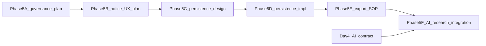

# Consent + Research Governance Implementation Plan

## Status

**Day 5 — docs-only governance planning**

This document defines how Wayfinder may govern consent, privacy notices, research participation, AI data use, and transformed research exports in future phases. It is **planning only**. It does **not** authorise consent persistence, schema changes, RLS changes, API changes, auth changes, signup behaviour changes, research UI, research exports, AI expansion, or journal save/read changes.

Read first:

- [AGENTS.md](../AGENTS.md)
- [docs/WAYFINDER_ALIGN_PRODUCT_CANON.md](./WAYFINDER_ALIGN_PRODUCT_CANON.md)
- [docs/WAYFINDER_AGENT_OPERATING_SYSTEM.md](./WAYFINDER_AGENT_OPERATING_SYSTEM.md)
- [docs/RESEARCH_AI_CAPABILITY_MAP.md](./RESEARCH_AI_CAPABILITY_MAP.md)
- [docs/ACTIVITY_PRACTICE_TAXONOMY.md](./ACTIVITY_PRACTICE_TAXONOMY.md)
- [docs/QUESTIONNAIRE_MEASURES_FRAMEWORK.md](./QUESTIONNAIRE_MEASURES_FRAMEWORK.md)
- [docs/AI_CONGRUENCE_ANALYSIS_CONTRACT.md](./AI_CONGRUENCE_ANALYSIS_CONTRACT.md)
- [docs/CURRENT_LAUNCH_STATUS.md](./CURRENT_LAUNCH_STATUS.md)
- [docs/auth-profile-flow.md](./auth-profile-flow.md)
- [docs/partner-collaboration-and-deployment-rules.md](./partner-collaboration-and-deployment-rules.md)

---

## Non-negotiable framing

Wayfinder is **not**:

- child diagnosis, child profiling, or behaviour labelling
- parent scoring, ranking, or fixed parent typing
- stage completion or “relationship fixed/solved” tracking
- a Behaviour → Advice parenting tool
- a substitute for clinical assessment or crisis intervention

Wayfinder **is** a parent emotional development pathway using ALIGN/CAB:

Behaviour → Need → Parent CAB → Alignment Check → Awareness → Growth → Navigate / Next Action

**Core principle:** Reduce user friction wherever possible while preserving privacy, consent clarity, auth/data safety, journal integrity, and ALIGN/CAB canon.

Use cautious language: **may**, **might**, **possible**, **appears to suggest**, **could be worth exploring**, **let's explore**.

---

## 1. Purpose and scope

### What Day 5 creates

Day 5 produces a **governance implementation plan** that:

- distinguishes ordinary app data use from future research, AI, export, and counsellor-governance purposes
- defines a **low-friction**, purpose-based consent and notice model
- specifies transformed research dataset rules and child-data boundaries
- maps future implementation phases with stop conditions and human/legal review gates

### What Day 5 does not authorise

Day 5 does **not** authorise:

- consent persistence or database tables
- SQL, RLS, or schema changes
- changes to signup, sign-in, or existing-user catch-up UI
- research opt-in/out UI
- research export jobs or pipelines
- AI API calls or prompt deployment
- journal save/read payload changes
- auth, profile, Parent ID / Child ID, or dashboard loading changes
- weakening PDPA/privacy wording
- HIPAA compliance claims

### Relationship to prior days

| Prior doc | Day 5 builds on |
|-----------|-----------------|
| Day 1 Capability Map | Evidence streams, consent Phase B/C/D roadmap |
| Day 2 Activity Taxonomy | Practice metadata as transformed research variables |
| Day 3 Questionnaire Framework | Measure participation, licensing, item vetting |
| Day 4 AI Contract | AI/data-use gates before free-text analysis expansion |

---

## 2. Current consent/privacy state

Wayfinder **already has** a signup privacy/data-use acknowledgement for normal app operation. Do **not** describe the current state as “no consent.”

### What exists today (Phase A)

| Topic | Current state | Notes |
|-------|---------------|-------|
| Signup privacy/data-use acknowledgement | UI checkbox at registration | Phase A — **not persisted** ([Capability Map §8](./RESEARCH_AI_CAPABILITY_MAP.md)) |
| Covers ordinary app operation | Yes | Account/profile, Parent ID, Child ID, activities, reflections, journal save/read, dashboard loading, parent-child reflection journey, app support |
| Research opt-in | Not implemented | Deferred |
| Consent persistence | Not implemented | Future Phase 5C/D |
| Questionnaires in app | Not live | Day 3 planning only |
| AI endpoints | Three live server endpoints | Expansion blocked until this plan + Day 4 contract satisfied |
| Identifiers in normal UI | Parent ID, Child ID | No parent email, Supabase UUID, child names, JWTs, or secrets in normal UI |
| Free-text reflections | User-typed | May contain accidental identifying details — privacy nudge in app copy |
| App Version page | Live | Viewing it is **not** research consent |

### Signup acknowledgement scope (conceptual)

The signup notice covers **ordinary app operation**, including:

- account and profile creation/retrieval
- generated Parent ID and Child ID use
- 52-day activity and reflection experience
- journal save and read
- dashboard loading and ALIGN Journey display
- Decode a Moment reflection flow
- normal app support and access protection

The signup copy may mention that **future** research or learning use would require clearer notice and appropriate safeguards. That forward-looking statement is **not** active research consent and must not be treated as authorisation for research export or expanded AI analysis.

---

## 3. App acknowledgement vs research consent vs AI/data-use notice

Consent and notice in Wayfinder are **purpose-based**. Different purposes require different governance — they must not be bundled invisibly into ordinary app use.

| Governance type | Purpose | Relationship to signup acknowledgement |
|-----------------|---------|----------------------------------------|
| **App data-use acknowledgement** | Ordinary app operation listed in Section 2 | Covered at signup — do not re-ask for unchanged app use |
| **Research participation consent or legal basis** | Enrolment in a study; eligibility for research datasets | **Separate** — app use does not automatically equal research consent |
| **AI-assisted analysis notice/consent** | Analysis of free-text reflections, Decode entries, or journals beyond existing approved endpoints | **Just-in-time** before expanded use; governed by [Day 4 contract](./AI_CONGRUENCE_ANALYSIS_CONTRACT.md) |
| **Questionnaire/measure participation** | Administration of licensed or approved measures | **Separate** — research-only by default ([Day 3](./QUESTIONNAIRE_MEASURES_FRAMEWORK.md)) |
| **Counsellor review visibility** | Professional access to reflection patterns or AI summaries | **Clear visibility notice** — not assumed from app signup alone |
| **Transformed/de-identified research export** | Creation of coded research datasets | **Separate** consent/eligibility + legal review |
| **Withdrawal handling** | Stop future use for a given purpose | Per-category; does not automatically delete ordinary journal history |

### Key rules

- **App use ≠ research consent.**
- **Signup acknowledgement ≠ AI analysis authorisation.**
- **Signup acknowledgement ≠ research export eligibility.**
- Research consent must **not** be bundled invisibly into ordinary app signup without clear, purpose-specific explanation.
- Parents should **not** be repeatedly asked to consent to the **same unchanged** ordinary app-use purpose.

---

## 4. Low-friction consent design principle

Wayfinder should use the **minimum necessary** consent or notice step for each purpose.

### Design rules

| Rule | Application |
|------|-------------|
| No repeated consent for unchanged app use | Signup acknowledgement remains sufficient for ordinary operation |
| Short notices at meaningful purpose changes | Just-in-time when a new feature introduces a new data use |
| Optional research consent only when research begins | Do not ask for research opt-in before research features exist |
| Do not block normal app use unnecessarily | Declining optional research must not block journal, dashboard, or activities |
| Progressive disclosure | Short parent-facing summary + “Learn more” for detail |
| Plain language | Avoid legal-heavy walls of text in primary notice |
| No dark patterns | Clear optional vs required; honest decline impact |
| Preserve trust | Clear without being heavy |

### Examples

| Scenario | Friction model |
|----------|----------------|
| Normal journal save/read | Covered by signup acknowledgement — no additional popup |
| New questionnaire module | Short questionnaire notice when module is first offered |
| AI-assisted analysis of free text | AI/data-use notice before first use of expanded analysis feature |
| Research export | Research consent/legal basis + de-identification review before any export |
| Counsellor visibility expansion | Visibility notice when counsellor access scope changes materially |
| Existing user, unchanged app use | No catch-up re-consent for purposes already covered at signup |

### Example parent-facing tone

> “Wayfinder uses your reflections to support your private app experience. Future optional research features may ask whether transformed, de-identified data can be used to improve the programme. You can use the app without joining research unless a feature is clearly marked as research-only.”

---

## 5. Future consent categories

Each category below is a **future governance unit**. None are implemented in Day 5.

### 5.1 App operation / data-use acknowledgement

| Field | Value |
|-------|-------|
| **Purpose** | Authorise ordinary app operation |
| **Parent-facing explanation** | “Wayfinder uses your account, profile, Parent ID, Child ID, activities, and reflections to provide your private reflection experience.” |
| **Mandatory or optional** | Mandatory for new account creation |
| **App continues if declined** | No — account cannot be created without acknowledgement |
| **Data involved** | Account, profile, IDs, activities, reflections, journal entries, dashboard data |
| **Future dependency** | Phase 5D persistence (optional record of notice version + timestamp) |

### 5.2 Research participation consent or legal basis

| Field | Value |
|-------|-------|
| **Purpose** | Enrol parent/dyad in approved research; establish export eligibility |
| **Parent-facing explanation** | “This optional research feature may use transformed, de-identified data to study parent alignment practice. You can choose whether to join.” |
| **Mandatory or optional** | Optional by default |
| **App continues if declined** | Yes — unless the feature itself is research-only and clearly marked |
| **Data involved** | Transformed research variables (Section 9) — not raw free text by default |
| **Future dependency** | Phase 5D persistence; ethics approval; legal basis documented |

### 5.3 AI-assisted analysis consent / notice

| Field | Value |
|-------|-------|
| **Purpose** | Govern expanded AI analysis of reflections, Decode entries, or journals |
| **Parent-facing explanation** | “Wayfinder may analyse your written reflections to suggest possible patterns. This is assistive, not a diagnosis. You can learn more about how this works.” |
| **Mandatory or optional** | Notice required; consent/opt-in per legal review for expanded use |
| **App continues if declined** | Yes — core app without expanded AI features |
| **Data involved** | Minimum necessary free text per Child ID; transformed AI marker outputs |
| **Future dependency** | Day 4 contract; Phase 5F; prompt/model governance |

### 5.4 Questionnaire / measure participation

| Field | Value |
|-------|-------|
| **Purpose** | Administer licensed or approved research measures |
| **Parent-facing explanation** | “This optional questionnaire helps research understand context. It is not a score about you or your child.” |
| **Mandatory or optional** | Optional — research-only by default |
| **App continues if declined** | Yes |
| **Data involved** | Licensed instrument responses; coded scale/subscale scores in export |
| **Future dependency** | Day 3 licensing; Phase 5E export SOP |

### 5.5 Counsellor review visibility

| Field | Value |
|-------|-------|
| **Purpose** | Govern counsellor access to reflection patterns, AI summaries, or review notes |
| **Parent-facing explanation** | “Your counsellor may review reflection summaries to support your work together. This is professional support, not child assessment.” |
| **Mandatory or optional** | Depends on service model — must be clear to parent |
| **App continues if declined** | Yes for app; counsellor-linked features may be unavailable |
| **Data involved** | Reflection summaries, AI coding, counsellor notes — not raw export by default |
| **Future dependency** | Counsellor RLS review; Phase 5F |

### 5.6 Transformed / de-identified research export

| Field | Value |
|-------|-------|
| **Purpose** | Create coded research datasets for approved studies |
| **Parent-facing explanation** | “If you join research, your data may be transformed into de-identified research variables — not your raw journal text.” |
| **Mandatory or optional** | Part of research participation governance |
| **App continues if declined** | Yes |
| **Data involved** | Transformed variables (Section 9) — not raw identifiers or free text by default |
| **Future dependency** | Phase 5E export SOP; legal/ethics review |

### 5.7 Publication / reporting safeguards

| Field | Value |
|-------|-------|
| **Purpose** | Govern how aggregate findings are reported externally |
| **Parent-facing explanation** | “Research results are reported in groups — not in ways that identify you or your child.” |
| **Mandatory or optional** | Internal governance requirement |
| **App continues if declined** | N/A — internal process |
| **Data involved** | Aggregate statistics; small-cell suppression |
| **Future dependency** | Phase 5E; legal review before publication |

### 5.8 Withdrawal and opt-out handling

| Field | Value |
|-------|-------|
| **Purpose** | Stop future research/AI/export use; honour parent choice |
| **Parent-facing explanation** | “You can withdraw from research at any time. Your private journal in the app stays unless you choose to delete your account.” |
| **Mandatory or optional** | Must be available where research/optional AI consent exists |
| **App continues if declined** | N/A — withdrawal is the parent action |
| **Data involved** | Consent status flags; future export eligibility |
| **Future dependency** | Phase 5D persistence; honest limits on irreversible anonymisation |

---

## 6. Existing-user catch-up approach

When new purposes are introduced after launch, use a **low-friction catch-up** model.

### Rules

- **Do not** force re-consent for unchanged ordinary app use already covered by signup acknowledgement.
- Show catch-up notice **only** for **new material purposes** (research opt-in, expanded AI analysis, questionnaire module, counsellor visibility change).
- **Avoid** blocking the whole app unless legally or privacy necessary for the new purpose.
- Provide **Accept / Not now / Learn more** where appropriate.
- **Preserve** existing journal access and dashboard function.
- **No retroactive** research or export use of pre-notice data without explicit governance decision (Section 7).

### Catch-up vs onboarding

| User state | New research feature launches | Catch-up behaviour |
|------------|------------------------------|-------------------|
| New user at signup | N/A | Signup acknowledgement + just-in-time notice when feature first offered |
| Existing user, unchanged app use | Feature not used | No popup |
| Existing user | New optional research module | Short notice when module first accessed |
| Existing user | Expanded AI analysis | Just-in-time notice before first expanded analysis |

---

## 7. Pre-notice data handling

Data created **before** a new research or AI notice takes effect requires explicit governance.

### Rules

- Do **not** automatically include pre-notice entries in research or expanded AI datasets.
- Distinguish **app operational history** from **research-eligible history**.
- Require an explicit governance decision (human/legal review) before including historical data in research exports or expanded AI training/analysis pools.
- **Default:** exclude raw historical free text from research exports.
- Historical **transformed variables** may become eligible only after review, appropriate legal basis, and documented `applies_from` eligibility rules.
- Consent records (Section 14) should support `applies_from` timestamps so eligibility is auditable.

---

## 8. Withdrawal handling

### Principles

- A parent **may continue normal app use** after withdrawing from research, unless the withdrawn purpose is required for a specific optional research-only feature they chose to use.
- Withdrawal from research **does not automatically delete** ordinary app journal history.
- Withdrawal **stops future** research use, export eligibility, and expanded AI use **where applicable** — enforced at query/export/analysis gate.
- **Exported or irreversibly anonymised aggregate data** may not always be practically removable once published or aggregated beyond re-identification. Use plain, honest language — do not overclaim “all data deleted everywhere.”
- Withdrawal is **per consent category** where categories differ (e.g. withdraw from research but continue optional AI feature, if ever offered separately).

### Example parent-facing withdrawal language

> “If you withdraw from research, Wayfinder will stop using your data for future research. Your reflections in the app will still be available to you. Data already transformed into de-identified research datasets before withdrawal may not always be removed from completed studies, but we will not add new data after your withdrawal date.”

---

## 9. Transformed Research Dataset Principle

Wayfinder's research pathway should **not** rely on raw lifted app data as the default research dataset. Research-use data should be **transformed, minimised, coded, and de-identified** wherever possible.

### A. Raw app data (not default export)

Examples:

- account and profile fields
- Parent ID / Child ID (direct identifiers)
- free-text reflections
- Decode entries (full payload)
- activity journals (full payload)
- exact timestamps
- questionnaire responses (raw)
- AI analysis outputs tied to direct identifiers

### B. Transformed research variables (default export target)

Examples:

- `research_participant_id` (pseudonymous)
- `dyad_research_id` (pseudonymous)
- `parent_age_band_life_context`
- `child_age_band_developmental_context`
- gender category (grouped)
- ethnicity category (grouped)
- questionnaire scale/subscale scores or coded responses
- ALIGN/CAB tags
- activity practice markers (`progress_signal`, `cab_domain`)
- AI-coded congruence markers (`present` / `emerging` / `not_yet_clear`)
- `timepoint` rather than exact timestamp where possible
- `consent_category` / `research_eligibility_status`

### C. Research export dataset rules

- Use **transformed variables by default**.
- **Exclude direct identifiers:** parent email, Supabase UUID, child names, addresses, school names, unnecessary exact timestamps.
- **Exclude raw free text by default.**
- Include **consent/research eligibility status** per record.
- Require **re-identification risk review** before export.
- Apply **small-cell suppression** or wider grouping when sample size is small.

### De-identification language — use and avoid

| Use | Avoid |
|-----|-------|
| transformed research variables | fully anonymised |
| coded research dataset | 95% anonymised |
| de-identified dataset | impossible to identify |
| anonymised (only where threshold + risk review support it) | guaranteed anonymous |

### Re-identification risk

Do **not** claim transformed data is automatically fully anonymous. Gender, age band, ethnicity, rare response patterns, small sample sizes, and unusual longitudinal patterns can still create re-identification risk when combined.

### Safeguards

- data minimisation
- age banding (Section 11)
- category grouping
- pseudonymous research IDs
- separation of identity mapping key from research dataset
- exclusion of raw free text unless separately reviewed and redacted
- human/legal review before export
- documented re-identification risk assessment

---

## 10. Child Data Boundary: Parent-Reported Observation, Not Child Profiling

Wayfinder does **not** directly collect child profiling information, child self-report questionnaires, direct child assessments, diagnostic child data, or clinician-administered child measures in the current parent app flow.

### A. Direct child profiling — not currently collected

Examples:

- direct child questionnaire responses
- child personality testing
- child diagnosis
- cognitive assessment
- temperament typing
- clinical assessment
- school or medical records
- direct child interviews

### B. Parent-reported child-related observations — within Wayfinder scope

Examples:

- “My child refused”
- “My child withdrew”
- “My child repeated questions”
- “My child had a meltdown”
- “My child seemed overwhelmed”
- “This happened during transition”
- possible child need named as parent reflection hypothesis

### Rules

- Treat parent-reported child behaviour as an **observation from the parent's perspective** — not objective child profiling.
- Do **not** infer the child's diagnosis, temperament, cognitive ability, intent, or personality.
- Do **not** describe the child as avoidant, oppositional, controlling, manipulative, disordered, or pathological.
- Do **not** treat child age band as proof of cognitive ability.
- Use child age band only as **developmental context** for interpreting parent-reported observations.
- Use **“possible need,” “may have needed,” “might suggest,”** and **“worth staying curious about.”**
- Preserve the pathway: Behaviour → Need → Parent CAB → Alignment Check → Awareness → Growth → Navigate / Next Action.

### Research wording

| Use | Avoid |
|-----|-------|
| parent-reported observed behaviour | child profile |
| parent-reported behavioural response | child assessment |
| dyadic moment | child personality |
| observed interaction context | child temperament type |
| possible child need hypothesis | child diagnosis |
| child developmental context | child pathology |
| | objective child trait |

### Research dataset rule

Child-related research variables should be derived from parent-reported observations and transformed into **non-diagnostic coded variables**, such as:

- `observed_behaviour_category`
- `interaction_context`
- `possible_need_category`
- `child_age_band_developmental_context`
- `dyad_research_id`
- `timepoint`

Do **not** export raw child names, direct identifiers, school names, clinical labels, or free-text child descriptions by default.

---

## 11. Age Banding for Research Variables

Wayfinder should use **developmentally meaningful age bands** for research — not arbitrary demographic buckets or maturity judgements.

### Parent age band — `parent_age_band_life_context`

Reflects adult life-cycle context, **not** parenting quality or maturity judgement.

| Band code | Meaning |
|-----------|---------|
| `under_18_special_review` | Requires special governance review if ever present |
| `18_24_emerging_adult` | Emerging adult |
| `25_34_early_adult` | Early adult |
| `35_44_established_adult` | Established adult |
| `45_54_midlife` | Midlife |
| `55_64_later_midlife` | Later midlife |
| `65_plus_older_caregiver` | Older caregiver |

### Child age band — `child_age_band_developmental_context`

Reflects developmental context for parent-reported observations, **not** direct cognitive profiling.

| Band code | Meaning |
|-----------|---------|
| `0_11_months_infant` | Infant |
| `1_2_young_toddler` | Young toddler |
| `2_3_older_toddler` | Older toddler |
| `3_5_preschool` | Preschool |
| `6_8_early_school_age` | Early school age |
| `9_11_middle_childhood` | Middle childhood |
| `12_14_early_adolescence` | Early adolescence |
| `15_17_late_adolescence` | Late adolescence |
| `18_24_young_adult_transition` | Young adult transition — adult-child relationship context |

### Legal status (separate variable)

| Code | Meaning |
|------|---------|
| `minor_under_18` | Minor child |
| `adult_18_plus` | Adult |
| `special_review_unknown` | Unknown — requires review |

For `18_24`, treat as **young adult transition / adult-child relationship context** — not ordinary minor-child data.

### Rules

- Do **not** use age bands as diagnosis, maturity judgement, cognitive label, or parent score.
- Do **not** infer cognitive ability with certainty from age band alone.
- Treat age band as **developmental context only**.
- For research export, **prefer age bands over exact age**.
- Include `age_band_method_version` so banding method is documented over time.
- If sample size is small, use **wider age bands** to reduce re-identification risk.

Age bands are **research context variables**. They do not replace parent reflection, possible child need exploration, CAB analysis, or human review.

---

## 12. Free-text reflection risk and de-identification limits

Free-text reflections **may contain identifying information** even when the app does not ask for it.

### Examples of accidental identifying content

- child names typed by parents
- school names
- locations
- family events
- diagnoses mentioned by parent
- names of relatives or professionals
- rare incidents
- exact dates or schedules

### Rules

- **Raw free text must not be exported by default.**
- Prefer **coded variables** (Section 9B) where possible.
- If excerpts are needed for qualitative review, require **separate human review and redaction**.
- Do **not** assume automated anonymisation is sufficient.
- Do **not** use raw free text in expanded AI prompts without approved privacy and AI governance ([Day 4 contract](./AI_CONGRUENCE_ANALYSIS_CONTRACT.md)).
- Privacy nudge in app copy should continue to encourage non-identifying reflections — without blaming parents who typed identifying details.

---

## 13. Parent-facing notice principles

| Principle | Requirement |
|-----------|-------------|
| Short | Primary notice readable in under one minute |
| Plain English | No unexplained legal or clinical jargon |
| Non-alarming | Factual, calm tone |
| Purpose-specific | Each notice names what it covers |
| Not buried | Visible at point of decision |
| Not over-legalistic | Detail behind “Learn more” |
| Learn more | Expandable detail for those who want it |
| No dark patterns | No hidden pre-checked research opt-in |
| Optional vs required | Stated clearly |
| Decline impact | Explain whether app use continues |
| Trust | Honest about limits and future use |

### Example notice snippets (illustrative only)

**Research opt-in:**

> “This optional research feature may use transformed, de-identified data — not your raw journal text — to help us understand whether ALIGN practice may support parent alignment capacity. You can use Wayfinder without joining. Learn more.”

**Expanded AI analysis:**

> “Wayfinder may read your written reflections to suggest possible patterns in your own response — not to diagnose your child. This is assistive, not authoritative. You can continue using the app without this feature. Learn more.”

**Questionnaire module:**

> “These optional questions are for research context only. They are not a score about you or your child. Learn more.”

---

## 14. Backend consent record concept (no schema)

This section defines a **conceptual** future consent record only. Day 5 does **not** create schema, SQL, or tables.

### Possible conceptual fields

| Field | Description |
|-------|-------------|
| `consent_record_id` | Unique record identifier |
| `parent_id` | App identity (not Supabase UUID in normal UI) |
| `user_id` | Technical auth identity — access-controlled |
| `consent_category` | e.g. app_acknowledgement, research_participation, ai_analysis |
| `consent_status` | e.g. accepted, declined, withdrawn |
| `notice_version` | Version of notice text shown |
| `consent_version` | Version of consent document if distinct from notice |
| `accepted_at` | ISO 8601 timestamp |
| `withdrawn_at` | ISO 8601 timestamp if withdrawn |
| `source_screen` | e.g. signup, catch_up_modal, research_module |
| `applies_from` | Eligibility start for research/AI/export use |
| `applies_to` | Optional end or scope boundary |
| `created_at` | Record creation |
| `updated_at` | Last update |

### Implementation notes (future only)

- Requires **schema and RLS review** before any implementation.
- Must remain compatible with `ensure_profile` and auth flow ([auth-profile-flow.md](./auth-profile-flow.md)).
- Browser code must **never** directly `profiles.insert` or `profiles.upsert`.
- Consent writes should go through approved server/RPC paths only.

---

## 15. RLS/security implications for future phases

Future implementation must evaluate these risks **before** any schema work. Day 5 does not implement any of this.

| Risk area | Questions to resolve |
|-----------|---------------------|
| Consent record access | Who can read/write consent records? Parent only? Service role for export jobs? |
| Research eligibility | How is eligibility checked before export or AI analysis? |
| Counsellor visibility | How is counsellor access gated per dyad and per purpose? |
| Export pipeline | How does export avoid direct identifiers and raw free text? |
| Identity mapping keys | How is pseudonymous ID ↔ direct ID mapping protected and separated? |
| Withdrawal enforcement | How is withdrawn status enforced at query, export, and AI gates? |
| AI analysis access | How does expanded AI avoid unauthorised data access or cross-dyad leakage? |

Reference high-risk path rules in [partner-collaboration-and-deployment-rules.md](./partner-collaboration-and-deployment-rules.md) and CODEOWNERS for `supabase.js`, SQL, and auth.

---

## 16. AI/data-use governance before AI analysis

No expansion of AI analysis of parent reflections, Decode entries, journals, or free text until **all** gates below are satisfied. Connect to [AI Congruence Analysis Contract](./AI_CONGRUENCE_ANALYSIS_CONTRACT.md).

| Gate | Requirement |
|------|-------------|
| AI purpose defined | Specific feature purpose documented — not vague “improve insights” |
| Parent notice/consent/legal basis | Just-in-time notice; opt-in if legal review requires |
| Prompt/model governance | Version metadata, human approval ([Day 4 §8](./AI_CONGRUENCE_ANALYSIS_CONTRACT.md)) |
| Raw data minimisation | Minimum necessary text per Child ID; no email, UUID, child name in prompts |
| Transformed output policy | Parent sees paraphrase; markers are internal coding states |
| Human review path | Counsellor review where sensitive or longitudinal ([Day 4 §7](./AI_CONGRUENCE_ANALYSIS_CONTRACT.md)) |
| Stop conditions preserved | Day 4 §11 halt rules remain in force |
| Pre-notice data | Section 7 rules applied |
| Existing endpoints | `/api/disc-insight`, `/api/disc-vision`, `/api/counsellor-analysis` remain governed separately; expansion is not automatic |

---

## 17. Research export governance

| Principle | Rule |
|-----------|------|
| Default dataset | Transformed variables (Section 9B) |
| Direct identifiers | Excluded |
| Raw free text | Excluded by default |
| Eligibility | Consent/research status checked before export |
| Review | Human/legal review required |
| Re-identification | Risk assessed and documented |
| Scope | Export scope documented per study |
| Small cells | Suppressed or grouped |
| External sharing | Separately approved |
| Audit trail | Required in future implementation |
| Child data | Parent-reported observation coding only (Section 10) |
| ALIGN/CAB | Coded markers — not diagnostic labels |

Cross-reference [Questionnaire Framework licensing rules](./QUESTIONNAIRE_MEASURES_FRAMEWORK.md) for instrument data in exports.

---

## 18. Human/legal review checkpoints

| Checkpoint | Before |
|------------|--------|
| Consent copy shown to parents | Any notice text reaches UI |
| Research opt-in implemented | Persistence or UI for research category |
| Questionnaire module connected to research | Instrument data enters export pipeline |
| AI analysis expands beyond existing approved endpoints | New `/api/*` or prompt scope change |
| Counsellor/research visibility expands | New counsellor data access |
| Schema/RLS implementation | Any consent or export table |
| Research export | Any dataset leaves controlled environment |
| Publication/reporting | External dissemination of findings |

Responsible roles: human owner, legal counsel, clinical/copy reviewer, research lead — assigned per checkpoint before implementation.

---

## 19. Future implementation phases after this plan

| Phase | Scope | Authorises |
|-------|-------|------------|
| **5A — Governance plan (Day 5)** | This document | **Nothing** |
| **5B — Consent copy and UX plan** | Draft parent-facing notices; low-friction flow design | Docs/copy only unless separately approved |
| **5C — Consent persistence design** | Schema/RLS proposal for consent records | High-risk review; **no implementation** |
| **5D — Consent persistence implementation** | Store notice version, timestamps, optional flags | Approved schema/RLS branch only |
| **5E — Research eligibility and export SOP** | Transformed dataset rules; export review checklist | Export governance docs + approved jobs |
| **5F — AI/research integration** | AI + research features together | Day 4 contract + this plan + RLS/security review |

### Mapping to Day 1 Phase B/C/D names

| Day 1 name | Day 5 phase | Focus |
|------------|-------------|-------|
| Phase B | 5C / 5D | Consent persistence |
| Phase C | 5E | Research evidence store and export |
| Phase D / AI layer | 5F | AI/research integration with counsellor governance |

---

## 20. Stop conditions

Stop consent/research governance planning, implementation, UI work, export, or notice publication and escalate to the human owner when:

| Condition | Action |
|-----------|--------|
| App use treated as automatic research consent | Halt |
| Normal app use blocked unnecessarily by optional research consent | Halt |
| Consent flow creates excessive friction without clear purpose | Halt |
| Parent asked to re-consent repeatedly for same unchanged purpose | Halt |
| Raw free text exported by default | Halt |
| Transformed data described as guaranteed anonymous | Halt |
| “95% anonymised” or similar unsupported language used | Halt |
| Direct child profiling implied or implemented | Halt |
| Child behaviour treated as objective diagnosis/assessment | Halt |
| Child age band treated as proof of cognitive ability | Halt |
| Parent/child IDs, journal save/read, auth, RLS, or dashboard changed without explicit approval | Halt |
| AI analysis expanded without consent/privacy governance | Halt |
| Research export proposed without eligibility and re-identification review | Halt |
| ALIGN/CAB canon weakened or child framed as the problem | Halt; report conflict |
| HIPAA compliance claimed without proper basis | Halt |
| Browser-side `profiles.insert` / `profiles.upsert` proposed for consent | Halt |

---

## 21. Related documents

| Document | Role |
|----------|------|
| [AGENTS.md](../AGENTS.md) | Operating rules, PDPA, auth, journal integrity |
| [WAYFINDER_ALIGN_PRODUCT_CANON.md](./WAYFINDER_ALIGN_PRODUCT_CANON.md) | ALIGN/CAB product framing |
| [WAYFINDER_AGENT_OPERATING_SYSTEM.md](./WAYFINDER_AGENT_OPERATING_SYSTEM.md) | Agent merge rules, platform sync privacy |
| [RESEARCH_AI_CAPABILITY_MAP.md](./RESEARCH_AI_CAPABILITY_MAP.md) | Day 1 evidence streams and consent roadmap |
| [ACTIVITY_PRACTICE_TAXONOMY.md](./ACTIVITY_PRACTICE_TAXONOMY.md) | Day 2 practice metadata |
| [QUESTIONNAIRE_MEASURES_FRAMEWORK.md](./QUESTIONNAIRE_MEASURES_FRAMEWORK.md) | Day 3 measures and item vetting |
| [AI_CONGRUENCE_ANALYSIS_CONTRACT.md](./AI_CONGRUENCE_ANALYSIS_CONTRACT.md) | Day 4 AI governance contract |
| [CURRENT_LAUNCH_STATUS.md](./CURRENT_LAUNCH_STATUS.md) | Release snapshot |
| [auth-profile-flow.md](./auth-profile-flow.md) | Auth and ensure_profile rules |
| [partner-collaboration-and-deployment-rules.md](./partner-collaboration-and-deployment-rules.md) | High-risk change rules |

---

## 22. Document control

| Field | Value |
|-------|-------|
| Title | Consent + Research Governance Implementation Plan |
| Day | 5 — docs-only governance planning |
| Branch | `docs/consent-research-governance-plan` |
| Base | `main` @ PR #13 (`55e305c`) |
| Status | Plan / docs-only |
| Runtime changes authorised | **No** |
| Consent persistence authorised | **No** |
| Schema/RLS authorised | **No** |
| AI calls authorised | **No** |
| Research export authorised | **No** |
| App Version entry | Not required unless user-facing app changes occur |
| Prerequisites | Days 0–4 merged on main |
