# MHP Profile Image Strategy

**PR #106 — docs/spec + storage contract planning only (no upload UI, no image generation)**

Read first:

- [AGENTS.md](../AGENTS.md)
- [WAYFINDER_ALIGN_PRODUCT_CANON.md](./WAYFINDER_ALIGN_PRODUCT_CANON.md)
- [MHP_OWNER_HANDOFF_RUNBOOK.md](./MHP_OWNER_HANDOFF_RUNBOOK.md)
- [CURRENT_LAUNCH_STATUS.md](./CURRENT_LAUNCH_STATUS.md)
- [supabase-mhp-profile-license.sql](../supabase-mhp-profile-license.sql)
- [supabase-mhp-owner-publish-contract.sql](../supabase-mhp-owner-publish-contract.sql)

---

## 1. Purpose

Wayfinder needs a **safe Mental Health Professional (MHP) profile image strategy** before public profile or directory work expands.

Today, `mental_health_professional_profiles.photo_url` supports a simple **Photo URL** text field. That is **not** the production workflow:

- A **local drive path** (for example `C:\Users\...`) is never valid.
- A **random public URL** is not the preferred workflow.
- Raw photos should not become the default public identity asset.

This document defines the preferred **private upload → illustrated portrait → owner review → publish** model aligned with the existing MHP **draft → review → publish** publication contract (PR #104 / PR #105).

- **User-facing label:** Mental Health Professional / MHP
- **Internal role:** `counsellor` (unchanged)

**No App Version entry** — MHP/admin infrastructure only (parent-facing portrait note is App Version v0.4.5 via PR #118 only).

---

## Production checkpoint principles (PR #106–PR #118)

The portrait pipeline is **live on main**. These principles are the production privacy model — not future planning.

| Principle | Rule |
|-----------|------|
| Private source photos | **Review inputs only** — stored in `professional-profile-image-sources`; never parent/client-visible |
| AI generation | **Candidate-only, not authoritative** — `generated_portrait` in owner/admin review; poor likeness → discard and use manual upload |
| Owner-approved portrait | **Only publishable portrait** — `approved_portrait` + `approved`; owner sets current via `selected_at` (PR #117) |
| Manual upload | **Trusted production fallback** — owner uploads final pencil sketch when AI candidate is not suitable (PR #113) |
| Current portrait | **`selected_at` defines current** — one selected approved portrait per MHP; older approved rows kept as history, not parent-visible |
| Parent display | **Selected approved portrait only** — for **published + visible + active** MHPs via server-signed URL (PR #118); no public bucket |
| Never to parents | No public bucket, no raw source photo, no generated candidate, no unselected approved history, no storage paths, no Supabase UUIDs |
| Legacy `photo_url` | **Not used** for this portrait pipeline; do not wire parent display to `photo_url` |

---

## Do not regress

Future work on MHP images, directories, or parent UI **must not**:

- make `professional-profile-image-sources` **public** or grant parent/client storage SELECT on source objects
- expose **`generated_portrait`** to parents or clients
- rely on **`photo_url`** for this portrait pipeline (reads or writes for display)
- show **unselected approved portraits** or portrait **history** to parents
- expose **storage paths** or **Supabase UUIDs** in parent/client UI
- weaken **owner/admin publication checks** (`profile_status`, `profile_visible`, `membership_status`, expiry)
- weaken **auth**, **RLS**, **journal save/read**, **Parent ID / Child ID**, or **ensure_profile** protections

When in doubt, read [CURRENT_LAUNCH_STATUS.md](./CURRENT_LAUNCH_STATUS.md) — **MHP Portrait Pipeline — Production Checkpoint** — and [MHP_OWNER_HANDOFF_RUNBOOK.md](./MHP_OWNER_HANDOFF_RUNBOOK.md) — § Owner-approved MHP portrait workflow.

---

## 2. What this PR does not do

PR #106 does **not**:

- implement upload UI in the MHP portal
- generate or transform images
- change `app.js`, `supabase.js`, `api/*`, or admin runtime behaviour
- publish profiles or images automatically
- build a public MHP profile directory
- expose source photos or draft portraits to parents/clients

This PR is **strategy + SQL/storage contract planning** for owner review before runtime PRs.

---

## 3. Current limitation: Photo URL

| Aspect | Current state | Problem |
|--------|---------------|---------|
| `photo_url` on MHP profile | Optional text field; MHP may paste any HTTPS URL | No private upload, no owner image review, no consistent Wayfinder visual identity |
| Admin review page (PR #105) | Shows `photo_url` preview only when safe HTTPS URL | Encourages ad-hoc public URLs instead of governed assets |
| Parent/client visibility | Governed by `profile_status`, `profile_visible`, `membership_status` | Image can appear public via URL even when publication intent is unclear |
| Storage | None for profile images | Licence PDFs use a separate private bucket contract |

**Interim rule until image runtime ships:** treat `photo_url` as **legacy / transitional**. Do not instruct MHPs to use local paths or unreviewed public URLs as production identity.

---

## 4. Preferred future workflow

```mermaid
flowchart LR
  upload[MHPUploadsSourcePhotoPrivate]
  generate[WayfinderGeneratesIllustratedPortrait]
  select[MHPPreviewsAndSelectsPortrait]
  review[OwnerAdminReviewsImageWithProfile]
  publish[OwnerPublishesProfileAndPortrait]
  parent[ParentClientSeesApprovedPortraitOnly]

  upload --> generate --> select --> review --> publish --> parent
```

**Status:** Implemented on main (PR #107–PR #118). Diagram reflects the **production** flow.



1. **MHP uploads source photo privately** — stored in a private bucket; never parent/client-visible.
2. **Owner may generate AI sketch candidate** — warm Wayfinder-style pencil sketch; **candidate-only**, not authoritative.
3. **Owner uploads and/or saves approved portrait** — manual upload is the trusted fallback; **Save as approved portrait** copies candidate when acceptable.
4. **Owner selects current approved portrait** — `selected_at` marks the one current row (PR #117).
5. **Owner/admin reviews and publishes profile** — publication unchanged from PR #104 / PR #105.
6. **Parent/client UI** shows **only the current selected approved portrait** for **published + visible + active** MHPs (PR #118).

Uploading or generating an image **does not publish** the profile. MHP self-publish remains disallowed. Owner/admin publication RPC remains the authority ([supabase-mhp-owner-publish-contract.sql](../supabase-mhp-owner-publish-contract.sql)).

---

## 5. Style guidance

### Preferred

- Wayfinder pencil portrait
- Warm illustrated professional portrait
- Soft neutral editorial sketch
- Consistent Wayfinder palette (sage, warm neutrals, restrained line work)

### Avoid

- Raw photo as default public identity
- Cartoonish or childlike styles
- Named external studio styles as product standard
- Clinical or medical stock imagery
- Exaggerated beauty filters
- Misleading identity changes (portrait must remain recognizably the same professional)

Portraits support **trust and recognition**, not marketing glamour or clinical certification claims.

---

## 6. Privacy and publication rules

| Rule | Detail |
|------|--------|
| Source photo | **Private always** — MHP + owner/admin only; review input, not public identity |
| Generated portrait candidates | **Private, candidate-only** — owner/admin; never parent/client-visible until saved as approved |
| Approved portrait | **Owner-approved only** — current row via `selected_at`; parent may see **only** that portrait when profile is **published + visible + active** |
| Image upload / generation | Does **not** change `profile_status` or publish profile |
| MHP self-publish | **Disallowed** — unchanged from PR #104 |
| Owner approval + selection | Required before any portrait becomes parent-visible; manual upload remains trusted fallback |
| Parent selector | Shows **selected approved portrait only** (PR #118) — signed URL server-side; not `photo_url`; no directory browse yet |

Parent/client visibility still requires:

- `profile_status = 'published'`
- `profile_visible = true`
- `membership_status = 'active'`
- membership not expired (where applicable)

---

## 7. Storage architecture (proposal)

Owner-applied Supabase Storage buckets — **private by default**:

| Bucket | Purpose | Access |
|--------|---------|--------|
| `professional-profile-image-sources` | Original source photos uploaded by MHP | Private; authenticated MHP own-folder upload (future); owner/admin read for review |
| `professional-profile-portraits` | Generated, uploaded, and approved portrait files | Private until approved; future controlled serving for published MHPs |

**Suggested path convention (future):**

- Sources: `professional-profile-image-sources/{auth.uid()}/{image_id}.jpg`
- Portraits: `professional-profile-portraits/{auth.uid()}/{image_id}.png`

**Future approved/public serving path** — **implemented (PR #118):** short-lived **signed URLs** from private `professional-profile-portraits` via server API; bucket stays private. Do **not** make source or draft portrait buckets public.

Storage **policies** are documented in [supabase-mhp-profile-image-storage.sql](../supabase-mhp-profile-image-storage.sql) as manual owner setup notes; full upload policies ship with the upload UI/API PR.

---

## 8. Data model (proposal)

Separate table recommended (not only `photo_url`):

- **Table:** `public.mental_health_professional_profile_images`
- **Contract file:** [supabase-mhp-profile-image-storage.sql](../supabase-mhp-profile-image-storage.sql)

| Field | Purpose |
|-------|---------|
| `id` | Primary key |
| `user_id` | MHP auth user |
| `image_kind` | `source_photo` / `generated_portrait` / `uploaded_portrait` / `approved_portrait` |
| `storage_bucket` | Supabase bucket name |
| `storage_path` | Object path (not a local filesystem path) |
| `mime_type` | Image MIME type |
| `file_size_bytes` | Size audit |
| `portrait_style` | e.g. `wayfinder_pencil_v1` (future generation) |
| `image_status` | `uploaded` / `generated` / `selected` / `approved` / `rejected` / `archived` |
| `created_at` | Insert time |
| `selected_at` | When owner marked an **approved_portrait** as the current selected portrait (PR #117). UI fallback: newest approved by `created_at` if none selected. |
| `approved_by` | Owner admin user id (future RPC) |
| `approved_at` | Owner approval timestamp |

### Do not store in this table

- Local file paths (`C:\...`, `file://`)
- Parent/child data, journal/reflection text
- Licence PDF paths (separate licence document table)
- Emails, tokens, invite data
- Raw extraction JSON from licence documents

**Legacy `photo_url`:** may remain during transition; future runtime should set it only from an **approved_portrait** record when owner publishes, or replace with a resolved approved-image URL field via RPC.

---

## 9. RLS and access (SQL contract summary)

From [supabase-mhp-profile-image-storage.sql](../supabase-mhp-profile-image-storage.sql):

- MHP (`counsellor`) may **read** own image metadata rows.
- MHP may **insert** own rows for non-approved kinds only (`source_photo`, `generated_portrait`, `uploaded_portrait`) in non-approved statuses.
- MHP **cannot** set `image_status = 'approved'` or `approved_by` / `approved_at` via RLS.
- **No** authenticated SELECT for other users' images.
- **No** anon access.
- Owner approval / rejection updates deferred to a **future owner-admin RPC PR** (same pattern as publication RPC).

---

## 10. PR sequence (delivered)

| Phase | PR theme | Delivers |
|-------|----------|----------|
| **#106** | Strategy + storage SQL contract | This doc + table/bucket contract |
| **#107** | MHP private source upload | Upload to source bucket |
| **#110** | Owner admin source review | `/admin.html` signed preview |
| **#113** | Owner approved portrait upload | Manual approved portrait to portraits bucket |
| **#114–#116** | AI sketch candidate + prompt tuning | Server-side generation; candidate-only |
| **#117** | Current approved selection | `selected_at` + owner RPC |
| **#118** | Parent approved portrait display | Review-sharing selector via `/api/list-available-mhps` |

Do not bundle regression-prone changes (public buckets, `photo_url` display, parent access to sources/generated/history) into unrelated PRs.

---

## 11. Owner decisions (open)

1. **Approved portrait serve mechanism** — **decided:** private bucket + server-signed URL (PR #118); CDN/public bucket still out of scope unless explicitly approved.
2. **Generation provider** — OpenAI Image API server-side (PR #114); must not send parent/child data.
3. **Whether MHP may upload their own illustrated portrait** (`uploaded_portrait`) without generation, still owner-approved — open.
4. **Rejection UX** — notify MHP to re-upload vs silent archive — open.
5. **Deprecation timeline for free-text `photo_url`** in MHP profile edit UI — open; **do not** use for parent portrait display.

---

## 12. Manual verification (after SQL apply)

Owner applies [supabase-mhp-profile-image-storage.sql](../supabase-mhp-profile-image-storage.sql) in Supabase SQL Editor, then:

```sql
select to_regclass('public.mental_health_professional_profile_images');
```

**Expected:** table exists; portrait rows for onboarded MHPs when pipeline used.

**Must not regress:** public bucket read on sources; parent-visible source/generated/history images; automatic profile publish on upload; parent display via `photo_url` or raw storage paths.

---

## Related docs

| Doc | Role |
|-----|------|
| [MHP_OWNER_HANDOFF_RUNBOOK.md](./MHP_OWNER_HANDOFF_RUNBOOK.md) | Owner operations |
| [supabase-mhp-profile-image-storage.sql](../supabase-mhp-profile-image-storage.sql) | SQL/storage contract |
| [supabase-mhp-owner-publish-contract.sql](../supabase-mhp-owner-publish-contract.sql) | Publication model |
