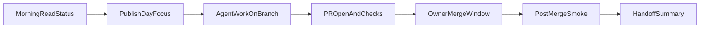
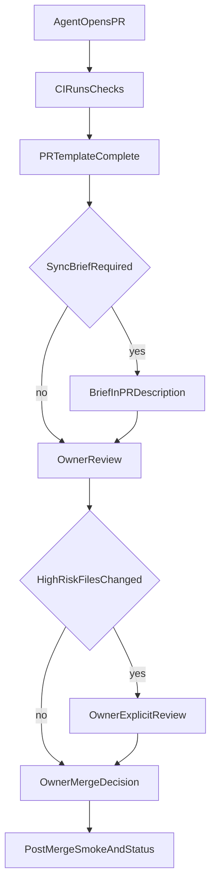

# Platform Sync + Production Operations Plan

## Status

**Day 8 — docs-only production operations**

This document defines how Wayfinder socialises context across platforms, runs repeatable production handoffs, and maintains continuity during the launch window and beyond.

**Important limits:**

- This does **not** change app runtime.
- This does **not** create monitoring code yet.
- This does **not** guarantee 24/7 staffed coverage automatically.
- It creates the **operating system** for handoff, checks, escalation, and production continuity.
- **Day 9** should handle any actual GitHub Actions production monitoring workflow if separately approved.

Read first:

- [docs/AGENT_HANDOFF_BRIEF.md](./AGENT_HANDOFF_BRIEF.md)
- [AGENTS.md](../AGENTS.md)
- [docs/WAYFINDER_ALIGN_PRODUCT_CANON.md](./WAYFINDER_ALIGN_PRODUCT_CANON.md)
- [docs/WAYFINDER_AGENT_OPERATING_SYSTEM.md](./WAYFINDER_AGENT_OPERATING_SYSTEM.md)
- [docs/CURRENT_LAUNCH_STATUS.md](./CURRENT_LAUNCH_STATUS.md)
- [docs/partner-collaboration-and-deployment-rules.md](./partner-collaboration-and-deployment-rules.md)

---

## 1. Purpose and scope

### What Day 8 creates

Day 8 produces a **production operations plan** that:

- defines how agents and platforms sync context without manual re-briefing
- establishes daily launch rhythm, handoff workflow, and check cadence
- categorises incidents and escalation paths
- documents existing automation and recommended next steps (Day 9+)
- preserves auth, privacy, journal integrity, and ALIGN/CAB canon

### What Day 8 does not authorise

Day 8 does **not** authorise:

- app runtime, UI, schema, RLS, API, or auth changes
- journal save/read or dashboard loading changes
- new GitHub workflow implementation (recommend only)
- production monitoring code or URL heartbeat automation
- OpenClaw / external webhook deployment
- AI calls, export code, consent persistence, or questionnaire implementation
- declaring 24/7 human coverage exists

---

## 2. Launch operations principle

| Principle | Rule |
|-----------|------|
| Safety first | Production safety outranks speed and convenience |
| Single lane | One branch, one merge at a time |
| Human merge gate | Only the human owner merges to `main` |
| Explicit handoffs | Every task ends with a filled handoff summary |
| No silent coordination | Agents document; they do not assume cross-platform state |
| Privacy in sync artifacts | No raw user data, tokens, or secrets in issues, PRs, or briefs |

Core product principle (unchanged): reduce coordination friction while preserving production safety.

---

## 3. 7-day launch operating rhythm

Daily target loop for the launch window (~2026-06-18 through ~2026-06-25):

| Step | Action | Owner |
|------|--------|-------|
| 1 | Read [CURRENT_LAUNCH_STATUS.md](./CURRENT_LAUNCH_STATUS.md) and [AGENT_HANDOFF_BRIEF.md](./AGENT_HANDOFF_BRIEF.md) | All agents |
| 2 | Pick **one** focused phase from backlog or launch plan | Human owner + lead agent |
| 3 | Open agent issue with allowlist, forbidden files, acceptance tests | Human owner |
| 4 | Branch from clean `main`; plan → build within scope | Assigned agent |
| 5 | Open PR; complete PR template and platform sync brief if required | Assigned agent |
| 6 | CI + Vercel preview + declared local test evidence | Agent + owner review |
| 7 | Owner merges **one** PR | Human owner |
| 8 | Production smoke test | Human owner |
| 9 | Update launch status if user-facing; post handoff summary | Human owner + agent |

Do not stack unmerged risky branches during the launch window.

---

## 4. Daily platform sync rhythm

| Time block | Activity |
|------------|----------|
| **T0 — Start of day** | Read launch status, handoff brief, open PRs/issues |
| **T1 — Focus publish** | Human owner or lead agent posts day focus: branch, allowlist, merge window |
| **T2 — Build window** | Work on assigned branch only; no parallel risky merges |
| **T3 — PR readiness** | PR open, CI green, template complete, sync brief if required |
| **T4 — Merge window** | Owner merges at most one production-impacting PR |
| **T5 — Post-merge** | Smoke test (user-facing); verify Vercel deploy |
| **T6 — End of day** | Handoff summary to all platforms; update launch status if shipped |

Off-hours: **monitor-only** — no merges unless P0 incident and owner approves.

---

## 5. How context is socialised across platforms

| Channel | Purpose | Privacy rule |
|---------|---------|--------------|
| GitHub `main` + docs | Source of truth for shipped state | No secrets in repo |
| [AGENT_HANDOFF_BRIEF.md](./AGENT_HANDOFF_BRIEF.md) | Pre-work orientation for every agent | Phase names, file lists, cautious summaries only |
| [CURRENT_LAUNCH_STATUS.md](./CURRENT_LAUNCH_STATUS.md) | Living release and in-flight snapshot | No user data |
| Agent issues (`.github/ISSUE_TEMPLATE/agent_task.yml`) | Task allowlist and acceptance tests | No production reflection content |
| PR description + template | Change declarations and guardrail confirmations | No tokens or user identifiers |
| [PLATFORM_SYNC_BRIEF_TEMPLATE.md](./PLATFORM_SYNC_BRIEF_TEMPLATE.md) | Cross-platform brief for significant changes | No raw user data |
| PR comments (`platform-sync-brief.yml`) | Automated sync-brief reminder on PRs | Links only |
| Handoff summary (§15 of brief) | End-of-task state for next platform | Structured, redacted |
| OpenClaw / webhooks | **Deferred** — manual copy until approved | Requires secrets setup |

Internal/docs-only PRs may skip the platform sync brief if the PR template declares no socialisation needed.

---

## 6. Agent handoff workflow

1. **Orient** — Read handoff brief, launch status, and issue allowlist.
2. **Confirm scope** — Allowed files only; stop if scope is unclear.
3. **Plan** — Plan first for non-trivial work (Cursor Plan mode or equivalent).
4. **Execute** — Implement within allowlist; do not expand scope silently.
5. **Check** — Run standard checks (see [AGENT_HANDOFF_BRIEF.md §12](./AGENT_HANDOFF_BRIEF.md)).
6. **Declare** — Complete PR template; add platform sync brief if required.
7. **Hand off** — Fill handoff summary template; tag owner for merge/smoke decisions.
8. **Stop** — Halt on stop conditions (§21); do not merge or patch production directly.

Agents do **not** merge to `main`. Agents do **not** run production changes outside a PR.

---

## 7. GitHub issue workflow

Use the **Agent task** issue template (`.github/ISSUE_TEMPLATE/agent_task.yml`).

Required intake fields:

| Field | Purpose |
|-------|---------|
| Task type / risk level | Scope and review depth |
| Phase name | Launch day or product phase |
| Cursor mode | Plan / Agent / Debug |
| Goal | Outcome, not just steps |
| Allowed files | Explicit allowlist |
| Forbidden files | Default high-risk paths from AGENTS.md |
| Acceptance tests | Browser and functional checks |
| Branch name | Standard naming |
| Socialisation requirement | none / platform-sync-brief / app-version / both |
| App Version requirement | required / not-needed / tbd |
| Stop conditions | When to halt and escalate |

Workflow:

1. Human owner creates or approves the issue.
2. Assigned agent acknowledges allowlist in first comment.
3. Agent links PR when ready.
4. Owner closes issue after merge, smoke, and handoff summary.

---

## 8. PR review and merge workflow

| Gate | Requirement |
|------|-------------|
| CI | `wayfinder-checks` and `wayfinder-guardrails` green |
| Template | PR template fully completed |
| Sync brief | Completed if user-facing, research, consent, or AI related |
| High-risk diff | Owner review — CODEOWNERS when branch protection enabled |
| UI changes | Vercel preview + local browser test evidence |
| Merge authority | **Human owner only** |
| Post-merge | Smoke test; update launch status if user-facing |

---

## 9. Production smoke test workflow

| Item | Rule |
|------|------|
| Trigger | Every user-facing merge to `main` |
| Executor | Human owner (Day 8) |
| Checklist | See [CURRENT_LAUNCH_STATUS.md](./CURRENT_LAUNCH_STATUS.md) and [AGENT_HANDOFF_BRIEF.md §13](./AGENT_HANDOFF_BRIEF.md) |
| Docs-only merges | Smoke optional unless production already unstable |
| Failure | Treat as P1 incident; pause further merges |
| Evidence | Record pass/fail in handoff summary or issue comment |

Day 8 does **not** automate smoke execution. Day 9 may add **reminder-only** automation if approved.

---

## 10. Round-the-clock production watch model

**Honest scope:** Day 8 defines process continuity, not staffed 24/7 coverage.

| Window | Mode | Actions allowed |
|--------|------|-----------------|
| **Active hours** | Full ops | Build, PR, owner merge, smoke, handoffs |
| **Off hours** | Monitor-only | Review CI status, open PRs, Vercel deploy log; **no merges** unless P0 and owner approves |
| **Next active block** | Catch-up | Triage overnight CI failures, stale PRs, failed deploys |

What runs 24/7 without human staffing:

- GitHub Actions on PRs (`wayfinder-checks`, `wayfinder-guardrails`)
- Vercel deploy on merge to `main`
- Platform sync brief PR comment bot

What does **not** run 24/7 in Day 8:

- Automated production URL heartbeat
- Automated auth/journal smoke tests
- Paging or on-call rotation

---

## 11. Incident categories

| Severity | Definition | Examples |
|----------|------------|----------|
| **P0 — Critical** | Production down or active data/auth integrity risk | Auth broken for all users; apparent data loss; verification gate bypass |
| **P1 — Major** | Core parent flow broken | Dashboard will not load; journal save fails; profile/`ensure_profile` path broken |
| **P2 — Moderate** | Feature regression, app still usable | UI layout break; non-critical widget failure; broken empty state |
| **P3 — Low** | Process, docs, or CI-only | Docs drift; CI flake; preview-only issue; template reminder misfire |

Research governance incidents (export leak, consent breach) follow P0/P1 escalation even if app appears up — see [RESEARCH_LAUNCH_READINESS_STUDY_OPERATIONS_PLAN.md](./RESEARCH_LAUNCH_READINESS_STUDY_OPERATIONS_PLAN.md).

---

## 12. Incident response steps

1. **Detect** — Smoke failure, user report, CI failure on `main`, Vercel deploy failure.
2. **Classify** — Assign P0–P3.
3. **Pause** — Stop merges if P0 or P1 open.
4. **Communicate** — Comment on issue/PR; post handoff summary with severity and last known good state.
5. **Diagnose** — Identify offending merge or config change; check high-risk diff.
6. **Remediate** — Fix on isolated branch or revert; owner approves path.
7. **Verify** — Re-run checks and full smoke test.
8. **Close** — Update launch status; document incident in handoff summary.

---

## 13. Escalation rules

| Condition | Action |
|-----------|--------|
| Agent hits stop condition | Halt work; comment on issue/PR; request owner decision |
| P0 / P1 incident | Owner decision in active window; pause all merges |
| ALIGN/CAB or PDPA conflict | No merge until owner + copy review |
| High-risk file touched without approval | Block merge; revert if already merged |
| CI red on `main` | No new merges until green or revert |
| Smoke fail after merge | P1 minimum; pause merges |
| Uncertainty on auth/RLS/journal | Escalate — do not guess |

Agents escalate; they do not unilaterally merge hotfixes to `main`.

---

## 14. Rollback / pause conditions

### Pause all merges when

- P0 or P1 incident open
- `main` CI failing without identified fix
- Production smoke failed after latest merge
- Auth, RLS, journal, or profile integrity uncertain
- Owner declares launch hold

### Rollback options (owner action)

1. **Git revert** — Revert offending merge commit on `main`
2. **Vercel rollback** — Redeploy last known good production deployment
3. **Forward fix** — Isolated branch with owner-approved minimal fix (preferred when revert is risky)

Document rollback decision in handoff summary.

---

## 15. What must be checked after every merge

- [ ] CI green on `main`
- [ ] Vercel production deploy succeeded
- [ ] Production smoke checklist (user-facing merges)
- [ ] [CURRENT_LAUNCH_STATUS.md](./CURRENT_LAUNCH_STATUS.md) updated if user-facing release shipped
- [ ] Handoff summary posted
- [ ] No open P0/P1 introduced by merge

---

## 16. What must be checked every day

- [ ] Read [CURRENT_LAUNCH_STATUS.md](./CURRENT_LAUNCH_STATUS.md)
- [ ] Review open PRs and failing checks
- [ ] Quick production URL load (manual — public page only)
- [ ] Confirm no unapproved high-risk diffs queued to merge
- [ ] Publish day focus (branch, allowlist, merge window) to platforms
- [ ] End-of-day handoff summary if work occurred

---

## 17. What must be checked before launch

- [ ] Latest `main` deployed to production
- [ ] Full production smoke on current `main`
- [ ] Auth verification gate, dashboard reads, journal save/read verified
- [ ] No open P0/P1 incidents
- [ ] App Version entries current for all user-facing releases since last parent-visible ship
- [ ] Deferred items explicitly listed (consent persistence, export code, questionnaire UI, etc.)
- [ ] Research launch go/no-go **separate** from app launch — docs alone do not authorise research enrolment

See [RESEARCH_LAUNCH_READINESS_STUDY_OPERATIONS_PLAN.md](./RESEARCH_LAUNCH_READINESS_STUDY_OPERATIONS_PLAN.md) for research-specific pre-launch criteria.

---

## 18. What automation already exists

| Asset | Purpose |
|-------|---------|
| [.github/workflows/wayfinder-checks.yml](../.github/workflows/wayfinder-checks.yml) | Baseline CI: whitespace, `node --check supabase.js`, profiles ban, ensure_profile/Bearer presence |
| [.github/workflows/wayfinder-guardrails.yml](../.github/workflows/wayfinder-guardrails.yml) | Extended CI: import/export scan, high-risk file warnings, App Version reminder |
| [.github/workflows/platform-sync-brief.yml](../.github/workflows/platform-sync-brief.yml) | PR comment reminder for platform sync brief |
| [.github/PULL_REQUEST_TEMPLATE.md](../.github/PULL_REQUEST_TEMPLATE.md) | PR guardrail checklist |
| [.github/ISSUE_TEMPLATE/agent_task.yml](../.github/ISSUE_TEMPLATE/agent_task.yml) | Structured agent task intake |
| [.github/CODEOWNERS](../.github/CODEOWNERS) | High-risk path ownership (enforceable when branch protection enabled) |
| [scripts/verify-wayfinder.ps1](../scripts/verify-wayfinder.ps1) | Local verification script (when available) |

Existing workflows do **not** auto-commit, auto-merge, or require external secrets.

---

## 19. What automation is recommended next

Prioritised for **Day 9+** with separate explicit approval:

| Priority | Automation | Scope | Notes |
|----------|------------|-------|-------|
| 1 | Scheduled daily launch-readiness issue | GitHub Actions cron | Checklist template only; no auto-merge |
| 2 | Production URL heartbeat | HTTP 200 on public URL | Does not test auth/journal paths |
| 3 | Post-merge smoke reminder | Issue or PR comment | Reminder-only |
| 4 | Weekly guardrail summary on `main` | Scheduled workflow | Report CI trend |
| 5 | OpenClaw webhook for handoff summaries | External integration | Requires secrets; deferred |

**Day 8 implements none of the above** — recommendation only.

---

## 20. Day 9 recommendation: Production Monitoring / Smoke Test Workflow

Proposed Day 9 branch (example): `automation/production-smoke-reminders`

| Deliverable | Description |
|-------------|-------------|
| Scheduled smoke-test reminder | Daily GitHub issue with manual smoke checklist |
| URL heartbeat | Optional workflow; failure opens or labels `production-watch` issue |
| Guardrail extension | Optional; baseline guardrails already exist |
| Platform sync daily issue | Optional complement to PR comment bot |

**Hard limits for Day 9:**

- Reminder and heartbeat only — **no auto-merge, no auto-rollback**
- No auth-session or journal smoke automation without separate approval
- No secrets added without owner review
- Fragile production workflow logic requires explicit approval

---

## 21. Stop conditions

Stop work and ask for human review when:

- `main` is dirty or production is unstable
- Checks fail and cannot be fixed within scope
- High-risk files touched without approval
- ALIGN/CAB or PDPA canon would be weakened
- Auth, RLS, profile integrity, or journal compatibility is at risk
- Production smoke test fails after merge
- Requested change conflicts with AGENTS.md or product canon
- Uncertainty about whether change is user-facing (App Version ambiguity)

---

## 22. Document control

| Document | Role | Update when |
|----------|------|-------------|
| [AGENT_HANDOFF_BRIEF.md](./AGENT_HANDOFF_BRIEF.md) | Pre-work agent orientation | Process, roles, or launch phase changes |
| [PLATFORM_SYNC_PRODUCTION_OPS.md](./PLATFORM_SYNC_PRODUCTION_OPS.md) | Ops rhythm, incidents, escalation | Process or automation changes |
| [CURRENT_LAUNCH_STATUS.md](./CURRENT_LAUNCH_STATUS.md) | Living release snapshot | After user-facing merges and smoke |
| [WAYFINDER_AGENT_OPERATING_SYSTEM.md](./WAYFINDER_AGENT_OPERATING_SYSTEM.md) | Day 0 automation rules | GitHub automation changes |
| [PLATFORM_SYNC_BRIEF_TEMPLATE.md](./PLATFORM_SYNC_BRIEF_TEMPLATE.md) | Per-PR cross-platform brief | Socialisation requirements change |

**Day 8 scope:** docs-only. No App Version entry. No workflow files changed.

---

## Related docs

- [docs/RESEARCH_LAUNCH_READINESS_STUDY_OPERATIONS_PLAN.md](./RESEARCH_LAUNCH_READINESS_STUDY_OPERATIONS_PLAN.md) — research ops and go/no-go (Day 7)
- [docs/partner-collaboration-and-deployment-rules.md](./partner-collaboration-and-deployment-rules.md) — risk tiers and deployment rules
- [docs/auth-profile-flow.md](./auth-profile-flow.md) — auth/profile guardrails
