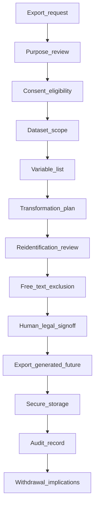
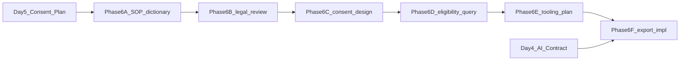

# Research Export SOP + Data Dictionary

## Status

**Day 6 — docs-only export governance**

This document defines the Standard Operating Procedure (SOP) and data dictionary for future Wayfinder research exports. It is **planning and governance only**. It does **not** authorise export code, CSV generation, database views, SQL, RLS policies, API routes, UI, consent persistence, AI calls, or the creation of actual research export files.

Read first:

- [AGENTS.md](../AGENTS.md)
- [docs/WAYFINDER_ALIGN_PRODUCT_CANON.md](./WAYFINDER_ALIGN_PRODUCT_CANON.md)
- [docs/WAYFINDER_AGENT_OPERATING_SYSTEM.md](./WAYFINDER_AGENT_OPERATING_SYSTEM.md)
- [docs/RESEARCH_AI_CAPABILITY_MAP.md](./RESEARCH_AI_CAPABILITY_MAP.md)
- [docs/ACTIVITY_PRACTICE_TAXONOMY.md](./ACTIVITY_PRACTICE_TAXONOMY.md)
- [docs/QUESTIONNAIRE_MEASURES_FRAMEWORK.md](./QUESTIONNAIRE_MEASURES_FRAMEWORK.md)
- [docs/AI_CONGRUENCE_ANALYSIS_CONTRACT.md](./AI_CONGRUENCE_ANALYSIS_CONTRACT.md)
- [docs/CONSENT_RESEARCH_GOVERNANCE_PLAN.md](./CONSENT_RESEARCH_GOVERNANCE_PLAN.md)
- [docs/CURRENT_LAUNCH_STATUS.md](./CURRENT_LAUNCH_STATUS.md)
- [docs/auth-profile-flow.md](./auth-profile-flow.md)
- [docs/partner-collaboration-and-deployment-rules.md](./partner-collaboration-and-deployment-rules.md)

**Core principle:** Research exports should use **transformed, minimised, coded, and de-identified research variables** wherever possible — not raw lifted app data.

---

## 1. Purpose and scope

### What Day 6 creates

Day 6 translates the [Consent + Research Governance Plan](./CONSENT_RESEARCH_GOVERNANCE_PLAN.md) (Day 5, Phase 5E) into:

- an export governance **SOP** — eligibility, workflow, review, and handling rules
- a **data dictionary** — variable definitions, transformation rules, and example export schema

### What Day 6 does not authorise

Day 6 does **not** authorise:

- export batch jobs, CSV files, or download UI
- database views, tables, or SQL for export
- RLS policies for export access
- API routes for export
- consent persistence implementation
- AI analysis or AI-generated export content
- actual research export file generation
- schema, auth, journal save/read, or dashboard changes

### Relationship to Day 5 Phase 5E

| Day 5 | Day 6 |
|-------|-------|
| Transformed dataset principle (§9) | Operational variable mapping (§7–15) |
| Export governance principles (§17) | Export SOP workflow (§19–22) |
| Age bands (§11) | Dictionary entries (§9–10) |
| Free-text rules (§12) | Exclusion SOP (§16) |

---

## 2. Non-negotiable Wayfinder framing

Wayfinder is **not**:

- a child-diagnosis app
- a child-profiling app
- a parent-scoring app
- a generic Behaviour → Advice tool

Wayfinder **is** a parent emotional development pathway:

Behaviour → Need → Parent CAB → Alignment Check → Awareness → Growth → Navigate / Next Action

### Research framing rules

| Principle | Meaning in export context |
|-----------|---------------------------|
| Behaviour is a signal | `observed_behaviour_category` codes parent-reported observation — not child diagnosis |
| Child data | Parent-reported observation — not direct child assessment or profiling |
| Parent data | Reflective development context — not parent score, type, or deficit |
| Research variables | Context and analysis variables — not clinical labels |
| ALIGN/CAB | Practice and reflection coding — not stage completion or mastery |

Use cautious language in all research documentation: **may**, **might**, **possible**, **appears to suggest**.

---

## 3. Export principles

| Principle | Rule |
|-----------|------|
| **Transformed by default** | Export coded research variables — not raw app payloads |
| **Minimum necessary** | Include only variables approved for the specific study scope |
| **No direct identifiers** | Exclude email, Supabase UUID, child names, addresses, school names |
| **No raw free text by default** | Exclude reflection text, decode narratives, journal prose |
| **Consent/eligibility first** | Check research eligibility before any export |
| **Re-identification review** | Assess and document risk before export |
| **Small-cell review** | Group or suppress rare combinations |
| **Human/legal review** | Sign-off required before export leaves controlled environment |
| **Documented purpose** | Every export tied to approved research purpose and scope |
| **No export without approval** | No ad-hoc or developer-initiated export from production |

### De-identification language

| Use | Avoid |
|-----|-------|
| transformed research variables | fully anonymised |
| coded research dataset | 95% anonymised |
| de-identified dataset | impossible to identify |
| anonymised (only where threshold + risk review support it) | guaranteed anonymous |

Transformed data is **not** automatically fully anonymous. Gender, age band, ethnicity, rare patterns, and small samples may still create re-identification risk when combined.

---

## 4. Export eligibility

An export may proceed only when **all** criteria below are satisfied:

| # | Criterion | Verified by |
|---|-----------|-------------|
| 1 | Approved research purpose documented | Research lead |
| 2 | Approved dataset scope (population, time range, dyad scope) | Research lead + owner |
| 3 | Approved consent or legal basis for export | Legal counsel |
| 4 | Approved variable list matches data dictionary | Research lead |
| 5 | Direct identifiers excluded from variable list | Export reviewer |
| 6 | Raw free text excluded or separately approved with redaction plan | Export reviewer + legal |
| 7 | Re-identification risk reviewed and documented | Research lead + legal |
| 8 | Withdrawal status checked for all included participants/dyads | Export operator |
| 9 | Human/legal sign-off complete (Section 20) | Named approvers |
| 10 | Export batch ID and dataset version assigned | Export operator |

If any criterion fails, **halt** — do not export.

---

## 5. Consent/research eligibility gate

### Distinctions

| Gate | Rule |
|------|------|
| App data-use acknowledgement | Covers ordinary app operation at signup — **not** research export permission |
| Research export permission | Requires `consent_research_status` = eligible (future persistence) or documented legal basis |
| Optional research refusal | Must **not** block normal app use unnecessarily |
| Pre-notice data | Requires separate governance decision before inclusion ([Day 5 §7](./CONSENT_RESEARCH_GOVERNANCE_PLAN.md)) |
| Withdrawal | Must be checked before export; withdrawn participants/dyads excluded from new exports |

### Eligibility status (conceptual)

| Status | Export allowed |
|--------|----------------|
| `eligible` | Yes — for approved scope and variable list |
| `declined` | No |
| `withdrawn` | No — for future use; existing irreversible aggregates may remain per honest withdrawal policy |
| `pre_notice_excluded` | No — unless separate governance decision documented |
| `not_applicable` | No — app-only user without research consent |

**Using the app is not automatic research export consent.**

---

## 6. Data source categories

This section lists **possible source categories** for future export transformation. Day 6 does **not** authorise new data collection.

| Source category | Live today | Default export treatment |
|-----------------|------------|-------------------------|
| Profile/context data | Yes | Age/gender bands; no UUID/email |
| Parent demographic/context | Partial (age, gender in profile) | Banded/categorised variables only |
| Dyad/child context | Yes (Child ID, child age/gender) | `dyad_research_id` + developmental bands |
| Activity practice metadata | Yes ([Day 2 taxonomy](./ACTIVITY_PRACTICE_TAXONOMY.md)) | Coded taxonomy variables |
| `behaviour_decode` entries | Yes | Coded ALIGN/CAB/observation variables — not raw payload |
| Journal/activity reflections | Yes | Coded variables — **not raw text** |
| Questionnaire/measure responses | **No** | Future only — licensed, consented |
| AI-coded congruence markers | **Partial** (counsellor AI) | Future governed export only |
| Counsellor review fields | Yes (counsellor workspace) | Future governed visibility only |

---

## 7. Raw app data vs transformed research variables

| Raw app data | Transformed research variable | Export eligibility | Notes |
|--------------|------------------------------|-------------------|-------|
| Supabase `user_id` | — | **Never export** | Technical auth identity |
| Parent email | — | **Never export** | Direct identifier |
| Parent ID / Wayfinder ID | `research_participant_id` | Default if pseudonymised | Do not export linkable Parent ID by default |
| Child ID | `dyad_research_id` | Default if pseudonymised | Per dyad; no cross-dyad pooling without study design |
| Exact parent age | `parent_age_band_life_context` | Default | Section 9 bands |
| Exact child age | `child_age_band_developmental_context` | Default | Section 10 bands |
| Exact timestamp | `study_timepoint` | Default | e.g. `baseline`, `follow_up_12w`, `entry_sequence` |
| Raw reflection free text | — | **Excluded by default** | Use coded CAB/ALIGN variables |
| Decode observed behaviour text | `observed_behaviour_category` | Default if coded | Parent-reported observation |
| Decode possible need text | `possible_need_category` | Default if coded | Exploratory hypothesis |
| Decode `align{}` structured fields | ALIGN/CAB coded variables | Default | Section 12 |
| Activity journal `activity` label | `activity_id` + taxonomy join | Default | Join via [Day 2 catalog](./ACTIVITY_PRACTICE_TAXONOMY.md) |
| Self-declared `MARKERS` | `practice_marker_claimed` | Optional | Self-report — not validated |
| AI summary text | AI marker state variables | Future only; excluded by default | Section 15 |
| Questionnaire item responses | Score bands | Future only | Section 14 |
| Counsellor narrative | — | Excluded by default | Separate governed path if ever approved |

---

## 8. Research ID strategy

### Identifier variables

| Variable | Purpose |
|----------|---------|
| `research_participant_id` | Pseudonymous parent identifier in research dataset |
| `dyad_research_id` | Pseudonymous parent–child dyad identifier |
| `export_batch_id` | Unique ID for one approved export run |
| `dataset_version` | Version of exported dataset content and scope |
| `variable_dictionary_version` | Version of this data dictionary satisfied |
| `age_band_method_version` | Version of age banding rules applied |

### Rules

- Do **not** export Supabase UUID, parent email, or child names.
- Do **not** export generated Parent ID or Child ID **by default** if still linkable to app identity in the same file.
- If an identity mapping key is ever needed, it must be stored **separately** with restricted access — **never** in the standard research export file.
- Research IDs should be generated for export purposes — not copied from app IDs without pseudonymisation review.

---

## 9. Parent demographic/context variables

### Recommended variables

| Variable | Description |
|----------|-------------|
| `research_participant_id` | Pseudonymous parent ID |
| `parent_age_band_life_context` | Adult life-cycle context band |
| `parent_gender_category` | Broad gender category if collected/approved |
| `parent_ethnicity_category` | Broad ethnicity category if collected/approved |
| `parent_role_context` | e.g. parent, caregiver — if collected/approved |
| `region_or_locale_broad` | Broad region/locale if collected/approved — not precise location |
| `consent_research_status` | Research eligibility status |
| `consent_version` | Version of research consent/notice |
| `study_timepoint` | Study wave or relative timepoint |

### Parent age bands — `parent_age_band_life_context`

| Band code | Meaning |
|-----------|---------|
| `under_18_special_review` | Requires special governance review if ever present |
| `18_24_emerging_adult` | Emerging adult |
| `25_34_early_adult` | Early adult |
| `35_44_established_adult` | Established adult |
| `45_54_midlife` | Midlife |
| `55_64_later_midlife` | Later midlife |
| `65_plus_older_caregiver` | Older caregiver |

### Rules

- Parent age bands reflect **life context** — not parenting quality, maturity judgement, or parent score.
- Categories must be **broad enough** to reduce re-identification risk.
- Small categories may require **grouping or suppression** (Section 18).

---

## 10. Child/dyad developmental context variables

### Recommended variables

| Variable | Description |
|----------|-------------|
| `dyad_research_id` | Pseudonymous dyad identifier |
| `child_age_band_developmental_context` | Developmental context band |
| `child_gender_category` | Broad category if collected/approved |
| `child_legal_status` | Minor/adult legal context |
| `dyad_sequence_number` | Ordinal dyad index if parent has multiple dyads — use cautiously |
| `study_timepoint` | Study wave or relative timepoint |
| `age_band_method_version` | Banding method version |

### Child age bands — `child_age_band_developmental_context`

| Band code | Meaning |
|-----------|---------|
| `0_11_months_infant` | Infant |
| `1_2_young_toddler` | Young toddler |
| `2_3_older_toddler` | Older toddler |
| `3_5_preschool` | Preschool |
| `6_8_early_school_age` | Early school age |
| `9_11_middle_childhood` | Middle childhood |
| `12_14_early_adolescence` | Early adolescence |
| `15_17_late_adolescence` | Late adolescence |
| `18_24_young_adult_transition` | Young adult transition — adult-child relationship context |

### Child legal status — `child_legal_status`

| Code | Meaning |
|------|---------|
| `minor_under_18` | Minor child |
| `adult_18_plus` | Adult |
| `special_review_unknown` | Unknown — requires review |

### Rules

- Child age band is **developmental context** for parent-reported observations — **not** cognitive assessment or proof of ability.
- `18_24` is **young adult transition / adult-child relationship context** — not ordinary minor-child data.
- Do **not** export child names or school names.

---

## 11. Parent-reported observation variables

Derived from Decode a Moment Awareness/Locate and similar parent-written observation — **not** objective child assessment.

| Variable | Description | Example allowed values (non-diagnostic) |
|----------|-------------|------------------------------------------|
| `observed_behaviour_category` | Parent-reported behaviour type | `refusal`, `withdrawal`, `meltdown`, `repeating_questions`, `restlessness`, `clinging`, `arguing`, `other` |
| `interaction_context_category` | Context of the moment | `transition`, `bedtime`, `homework`, `mealtime`, `social_setting`, `other` |
| `possible_need_category` | Parent hypothesis of emerging need | `safety`, `connection`, `control_agency`, `predictability`, `emotional_regulation`, `sensory_regulation`, `avoidance_overwhelm`, `help_expressing`, `not_sure` |
| `parent_reported_intensity_band` | Subjective intensity if coded | `low`, `moderate`, `high`, `not_reported` |
| `transition_context_flag` | Transition-related moment | `true`, `false`, `not_reported` |
| `sensory_context_flag` | Sensory-related context mentioned | `true`, `false`, `not_reported` |
| `regulation_context_flag` | Regulation-related context mentioned | `true`, `false`, `not_reported` |

### Rules

- These are **parent-reported observations** — not objective child assessment.
- Do **not** infer diagnosis, temperament, motive, pathology, personality, or cognitive ability from these codes.
- Use **cautious non-diagnostic coding** only.
- Do **not** export raw text describing the child by default.

---

## 12. ALIGN/CAB variables

Reflective practice coding — **not** parent scores or clinical interpretation.

| Variable | Description | Typical values |
|----------|-------------|----------------|
| `align_stage_touched` | ALIGN stage explored in entry | `A`, `L`, `I`, `G`, `N`, combinations |
| `awareness_observation_present` | Awareness evidence coded | `true`, `false`, `not_clear` |
| `locate_need_identified` | Possible need located | `true`, `false`, `not_clear` |
| `integrate_cognition_present` | Parent cognition named | `true`, `false`, `not_clear` |
| `integrate_affect_present` | Parent affect named | `true`, `false`, `not_clear` |
| `integrate_behaviour_present` | Parent behaviour named | `true`, `false`, `not_clear` |
| `alignment_gap_named` | Misalignment language present | `true`, `false`, `not_clear` |
| `growth_capacity_category` | Named growth capacity | coded category from decode options |
| `navigate_next_action_present` | Next action stated | `true`, `false`, `not_clear` |
| `repair_intention_category` | Repair intention coded | `none`, `reconnect`, `apologise`, `explain`, `try_again_later`, `other` |
| `cab_domain_primary` | Primary CAB domain | `affect`, `cognition`, `behaviour`, `integration`, `co_regulation`, `repair` |
| `cab_domain_secondary` | Secondary domain if applicable | same enum or `none` |
| `reflection_depth_band` | Sufficiency of written reflection if assessed | `minimal`, `moderate`, `substantive`, `not_assessed` |

### Rules

- **No parent score**, percentile, or rank.
- **No stage completion score** or mastery label.
- **No diagnostic interpretation** of parent or child.
- Decode form completion ≠ stage mastery — code written/substantive evidence where assessed.

---

## 13. Activity practice taxonomy variables

Derived from [Activity Practice Taxonomy](./ACTIVITY_PRACTICE_TAXONOMY.md) joined at export time via activity label.

| Variable | Description |
|----------|-------------|
| `activity_id` | e.g. `A-01` … `N-10` |
| `activity_label` | Exact legacy label string |
| `align_stage` | `A`, `L`, `I`, `G`, or `N` |
| `cab_domain` | Primary CAB practice focus |
| `practice_marker` | Suggested MARKERS key |
| `progress_signal` | e.g. `awareness_exposure`, `locate_exposure` |
| `difficulty_or_rhythm` | e.g. `gentle`, `reflective`, `repair` |
| `activity_completion_flag` | Reflection submitted for activity |
| `post_practice_reflection_present` | Non-empty reflection text exists — flag only; text not exported |

### Rules

- Activity completion is **practice exposure evidence** — not parent competence score.
- `progress_signal` values are **research tags** — not proof of mastery.
- Do **not** infer child improvement from activity completion.
- `activity_id` is **not persisted** in journal today — join at export time via label.

---

## 14. Questionnaire/measure variables (future only)

**Not live in app.** Export only after questionnaire module, licensing, and consent governance are approved.

| Variable | Description |
|----------|-------------|
| `measure_id` | Approved instrument identifier |
| `measure_version` | Instrument version administered |
| `measure_domain` | Domain from [Day 3 framework](./QUESTIONNAIRE_MEASURES_FRAMEWORK.md) |
| `scale_score_band` | Banded scale score — not raw score unless approved |
| `subscale_score_band` | Banded subscale score |
| `response_validity_flag` | Validity indicator if approved instrument supports it |
| `completed_at_timepoint` | Study timepoint of completion |

### Rules

- Respect [Day 3 licensing and item vetting](./QUESTIONNAIRE_MEASURES_FRAMEWORK.md).
- Do **not** export item-level responses unless separately approved.
- Prefer **score bands** over raw scores.
- No clinical diagnosis from questionnaire export unless explicitly part of a professionally governed instrument and review path.

---

## 15. AI-coded congruence variables (future only)

Connect to [AI Congruence Analysis Contract](./AI_CONGRUENCE_ANALYSIS_CONTRACT.md). **Not default export today.**

| Variable | Description |
|----------|-------------|
| `ai_marker_schema_version` | AI marker schema version |
| `prompt_version` | Approved prompt version |
| `model_id` | Approved model identifier |
| `evidence_sufficiency` | e.g. `none`, `single_moment`, `early`, `sufficient_for_cautious_pattern` |
| `cab_evidence_state` | Per component: `present`, `emerging`, `not_yet_clear` |
| `align_evidence_state` | Per stage: same three states |
| `alignment_check_state` | Alignment check coding state |
| `possible_misalignment_category` | Exploratory theme e.g. urgency vs predictability |
| `review_status` | e.g. `pending`, `approved`, `suppressed` |

### Rules

- **Future only** — governed export path required.
- No raw AI parent summaries in export by default.
- No parent-facing congruence score.
- No child diagnosis, parent type, or clinical conclusion from AI markers.
- AI output requires prompt/model/version governance and consent/privacy review.

---

## 16. Free-text exclusion and excerpt review rules

### Default rule

**Raw free text is excluded from research export by default.** This includes:

- activity journal prose
- decode free-text fields
- counsellor notes
- AI-generated summary text
- questionnaire open-ended responses

Free text may contain child names, school names, locations, family events, diagnoses mentioned by parents, professional names, rare incidents, and exact dates — even when the app does not request them.

### If excerpts are ever needed (exception path)

| Requirement | Rule |
|-------------|------|
| Separate approval | Human/legal sign-off beyond standard variable list |
| Manual redaction | Identifiers removed before inclusion |
| PII scan | Review for accidental identifying content |
| No child names | Excluded |
| No school names | Excluded |
| No exact locations | Excluded unless necessary and approved |
| No exact dates | Excluded unless necessary and approved |
| No clinical labels | Excluded unless explicitly reviewed |
| Quote minimisation | Shortest necessary excerpt |
| Consent/legal basis | Confirmed for excerpt use |

Automated anonymisation alone is **not** sufficient without human review.

---

## 17. Re-identification risk review

Before export, assess:

| Risk factor | Review question |
|-------------|-----------------|
| Sample size | Is N large enough for chosen variables? |
| Rare demographic combinations | Could ethnicity + age + gender identify a dyad? |
| Small dyad groups | Could multi-child parents be identified? |
| Rare behaviour/context combinations | Could unusual coded pattern identify a family? |
| Longitudinal uniqueness | Could entry sequence + timepoint identify a participant? |
| Free-text details | Any excerpt still identifying? |
| Exact timestamps | Do they remain in export? |
| External linkage | Could export be linked to external datasets? |

### Required actions when risk is elevated

- **Group** categories into broader bands
- **Suppress** small cells
- **Remove** exact timestamps — use `study_timepoint` only
- **Remove or generalise** rare categories
- **Document** risk decision in export metadata
- **Halt** if risk cannot be mitigated

---

## 18. Small-cell suppression/grouping rules

### Conceptual rules

- If a subgroup is **too small**, **group** with adjacent category or **suppress** from export tables.
- Do **not** export tables or rows that could identify a rare parent, child, or dyad pattern.
- Exact numeric threshold (e.g. minimum cell size N) requires **future legal/research decision** — do not pretend a final standard exists in this document.
- Document suppression method in `dataset_version` metadata and export audit record.

### Example suppression approaches (conceptual)

| Situation | Action |
|-----------|--------|
| Single dyad in ethnicity category | Merge category or exclude ethnicity from this export |
| One participant in age band | Widen age band or exclude row |
| Rare behaviour + context combo | Suppress cross-tab or report aggregate only |
| Longitudinal N=1 pattern | Do not export participant-level longitudinal file |

---

## 19. Export request workflow

| Step | Action | Owner |
|------|--------|-------|
| 1 | Export request submitted with purpose and scope | Requestor |
| 2 | Research purpose reviewed and approved | Research lead + owner |
| 3 | Consent eligibility reviewed | Legal + research lead |
| 4 | Dataset scope approved (population, time, dyads) | Research lead |
| 5 | Variable list approved against data dictionary | Research lead |
| 6 | Data transformation plan reviewed | Export operator + research lead |
| 7 | Re-identification risk reviewed | Research lead + legal |
| 8 | Free-text exclusion confirmed (or excerpt path approved) | Export reviewer |
| 9 | Human/legal sign-off complete | Named approvers (Section 20) |
| 10 | Export generated | Future implementation only |
| 11 | Export stored securely | Future implementation |
| 12 | Export audit record created | Future implementation |
| 13 | Post-export withdrawal implications documented | Research lead |

---

## 20. Human/legal review checklist

Complete before Step 10 (export generation):

| # | Check | Pass |
|---|-------|------|
| 1 | Research purpose documented | ☐ |
| 2 | Consent/legal basis confirmed | ☐ |
| 3 | Variable list reviewed against data dictionary | ☐ |
| 4 | Direct identifiers removed | ☐ |
| 5 | Raw free text excluded or separately approved with redaction | ☐ |
| 6 | Child data boundary preserved — parent-reported observation only | ☐ |
| 7 | No child profiling variables or language | ☐ |
| 8 | No parent scoring variables | ☐ |
| 9 | No AI overclaim — future AI vars governed by Day 4 | ☐ |
| 10 | Small-cell review completed | ☐ |
| 11 | Withdrawal status checked | ☐ |
| 12 | Export access approved — named reviewers only | ☐ |
| 13 | `export_batch_id` and `dataset_version` recorded | ☐ |

**Sign-off (conceptual):**

| Role | Name | Date | Export batch ID |
|------|------|------|-----------------|
| Research lead | | | |
| Legal counsel | | | |
| Human owner | | | |

---

## 21. Export file handling and access controls

| Control | Rule |
|---------|------|
| Access | Restricted to named authorised reviewers and approved researchers |
| Public storage | **Prohibited** |
| Email attachments | **Not default** — use secure transfer |
| Encryption | Preferred at rest and in transit |
| Audit log | Required in future implementation — who accessed what and when |
| Retention | To be defined per study agreement |
| Deletion/archival | To be defined — document in export metadata |
| Secrets | No JWTs, tokens, API keys, or service credentials in export files |

---

## 22. Withdrawal handling in export context

| Rule | Detail |
|------|--------|
| Pre-export check | Withdrawal status verified before every export |
| Future use | Withdrawal stops **future** research use and new export inclusion |
| App journal | Withdrawal from research does **not** automatically delete ordinary app journal history |
| Irreversible aggregates | Already exported anonymised aggregate data may not always be removable — explain honestly to parents |
| Pseudonymised mapping | If identity mapping exists, withdrawal may require mapping review |
| Export after withdrawal | Do not add new data from withdrawn participant/dyad after withdrawal date |

See [Day 5 §8](./CONSENT_RESEARCH_GOVERNANCE_PLAN.md).

---

## 23. Data dictionary table format

Every variable in Sections 8–15 should be documented using these columns:

| Column | Description |
|--------|-------------|
| `variable_name` | Machine-readable name |
| `variable_label` | Human-readable label |
| `source_category` | From Section 6 |
| `source_field_or_derivation` | App field or derivation rule |
| `transformation_rule` | How raw becomes transformed |
| `allowed_values` | Enum, band list, or format |
| `data_type` | e.g. string, boolean, categorical, integer |
| `export_required_or_optional` | `required`, `optional`, or `future_only` |
| `consent_dependency` | Consent category required |
| `sensitivity_level` | `low`, `medium`, `high` |
| `reidentification_risk` | `low`, `medium`, `high` + brief note |
| `notes` | ALIGN/CAB framing, cautions |

### Example dictionary entry

| Field | Value |
|-------|-------|
| `variable_name` | `possible_need_category` |
| `variable_label` | Possible child need (parent hypothesis) |
| `source_category` | behaviour_decode / parent-reported observation |
| `source_field_or_derivation` | Decode Locate selections or coded from structured field |
| `transformation_rule` | Map to approved non-diagnostic enum; exclude raw text |
| `allowed_values` | `safety`, `connection`, `control_agency`, `predictability`, … |
| `data_type` | categorical |
| `export_required_or_optional` | optional |
| `consent_dependency` | research_participation |
| `sensitivity_level` | medium |
| `reidentification_risk` | low–medium — rare combos with small N |
| `notes` | Exploratory parent hypothesis — not child diagnosis |

---

## 24. Example transformed export schema

**Conceptual only — not generated by Day 6.** Illustrates wide-format row structure for one dyad-moment or dyad-entry record.

### Variable columns (example set)

`export_batch_id`, `dataset_version`, `variable_dictionary_version`, `research_participant_id`, `dyad_research_id`, `parent_age_band_life_context`, `parent_gender_category`, `parent_ethnicity_category`, `child_age_band_developmental_context`, `child_legal_status`, `study_timepoint`, `entry_type`, `observed_behaviour_category`, `possible_need_category`, `interaction_context_category`, `cab_domain_primary`, `align_stage_touched`, `growth_capacity_category`, `repair_intention_category`, `activity_id`, `progress_signal`, `consent_research_status`, `export_eligibility_status`, `questionnaire_domain_future`, `ai_marker_schema_version_future`

### Example synthetic rows (illustrative — not real user data)

| export_batch_id | dyad_research_id | parent_age_band_life_context | child_age_band_developmental_context | study_timepoint | entry_type | observed_behaviour_category | possible_need_category | align_stage_touched | consent_research_status | export_eligibility_status |
|-----------------|------------------|-------------------------------|--------------------------------------|-----------------|------------|----------------------------|------------------------|---------------------|-------------------------|---------------------------|
| EXP-2026-001 | DYAD-00042 | 35_44_established_adult | 6_8_early_school_age | baseline | behaviour_decode | refusal | predictability | L,I | eligible | approved |
| EXP-2026-001 | DYAD-00042 | 35_44_established_adult | 6_8_early_school_age | baseline | activity_journal | — | — | A | eligible | approved |

No raw free text, Parent ID, Child ID, email, or UUID appears in this example schema.

---

## 25. Stop conditions

Halt export planning, dictionary publication, or implementation and escalate to the human owner when:

| Condition | Action |
|-----------|--------|
| Export code proposed inside Day 6 docs PR | Halt — wrong phase |
| Schema, RLS, API, auth, or journal files changed without approval | Halt |
| Raw free text exported by default | Halt |
| Direct identifiers included in default variable list | Halt |
| Transformed data called guaranteed anonymous | Halt |
| “95% anonymised” or similar unsupported language used | Halt |
| Child observations treated as child profiling | Halt |
| Age bands treated as cognitive assessment | Halt |
| App use treated as automatic research export consent | Halt |
| Optional research refusal blocks normal app use unnecessarily | Halt |
| AI variables used without Day 4 governance | Halt |
| Questionnaire variables ignore Day 3 licensing/vetting | Halt |
| Small-cell or re-identification risk ignored | Halt |
| Withdrawal status ignored before export | Halt |
| ALIGN/CAB canon weakened or child framed as problem | Halt; report conflict |

---

## 26. Future implementation phases

| Phase | Scope | Authorises |
|-------|-------|------------|
| **6A — SOP/data dictionary (Day 6)** | This document | **Nothing** |
| **6B — Variable review with legal/research advisor** | Validate dictionary, thresholds, suppression rules | Docs revision |
| **6C — Consent persistence/schema design** | Eligibility query design if needed | High-risk design only |
| **6D — Research eligibility query design** | How export gate reads consent status | Design doc |
| **6E — Export tooling plan** | Batch architecture, audit log design | Plan only |
| **6F — Controlled export implementation** | Actual export generation | High-risk branch after 6B–6E + Day 5 |

Day 6 delivers operational detail for **Day 5 Phase 5E**.

---

## 27. Related documents

| Document | Role |
|----------|------|
| [AGENTS.md](../AGENTS.md) | Operating rules, PDPA, journal integrity |
| [WAYFINDER_ALIGN_PRODUCT_CANON.md](./WAYFINDER_ALIGN_PRODUCT_CANON.md) | ALIGN/CAB product framing |
| [WAYFINDER_AGENT_OPERATING_SYSTEM.md](./WAYFINDER_AGENT_OPERATING_SYSTEM.md) | Agent merge rules |
| [RESEARCH_AI_CAPABILITY_MAP.md](./RESEARCH_AI_CAPABILITY_MAP.md) | Day 1 evidence streams and export privacy |
| [ACTIVITY_PRACTICE_TAXONOMY.md](./ACTIVITY_PRACTICE_TAXONOMY.md) | Day 2 activity variable source |
| [QUESTIONNAIRE_MEASURES_FRAMEWORK.md](./QUESTIONNAIRE_MEASURES_FRAMEWORK.md) | Day 3 measure licensing and vetting |
| [AI_CONGRUENCE_ANALYSIS_CONTRACT.md](./AI_CONGRUENCE_ANALYSIS_CONTRACT.md) | Day 4 AI marker governance |
| [CONSENT_RESEARCH_GOVERNANCE_PLAN.md](./CONSENT_RESEARCH_GOVERNANCE_PLAN.md) | Day 5 consent and transformed dataset principles |
| [CURRENT_LAUNCH_STATUS.md](./CURRENT_LAUNCH_STATUS.md) | Release snapshot |
| [auth-profile-flow.md](./auth-profile-flow.md) | Auth and profile rules |
| [partner-collaboration-and-deployment-rules.md](./partner-collaboration-and-deployment-rules.md) | High-risk change rules |

---

## 28. Document control

| Field | Value |
|-------|-------|
| Title | Research Export SOP + Data Dictionary |
| Day | 6 — docs-only export governance |
| Branch | `docs/research-export-sop-data-dictionary` |
| Base | `main` @ PR #15 (`9731914`) |
| Status | Plan / docs-only |
| Runtime changes authorised | **No** |
| Export implementation authorised | **No** |
| Schema/RLS authorised | **No** |
| AI calls authorised | **No** |
| Consent persistence authorised | **No** |
| App Version entry | Not required unless user-facing app changes occur |
| Prerequisites | Days 0–5 merged on main |
| Delivers | Day 5 Phase 5E operational detail |
