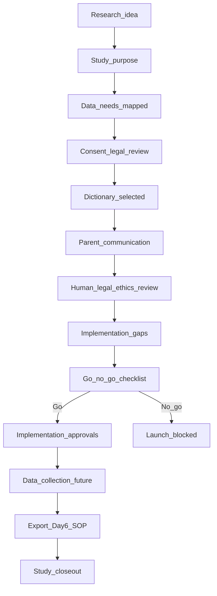

# Research Launch Readiness Checklist + Study Operations Plan

## Status

**Day 7 — docs-only operational readiness**

This document consolidates Days 1–6 into a research launch readiness checklist and study operations plan. It is **planning and governance only**. It does **not** authorise research launch, runtime changes, UI changes, consent persistence, schema/RLS, API changes, auth changes, journal save/read changes, AI calls, questionnaire implementation, export code, or research exports.

**Critical:** Completing this document does **not** mean Wayfinder research is ready to launch. Docs alone do not equal research launch readiness.

Read first:

- [AGENTS.md](../AGENTS.md)
- [docs/WAYFINDER_ALIGN_PRODUCT_CANON.md](./WAYFINDER_ALIGN_PRODUCT_CANON.md)
- [docs/WAYFINDER_AGENT_OPERATING_SYSTEM.md](./WAYFINDER_AGENT_OPERATING_SYSTEM.md)
- [docs/RESEARCH_AI_CAPABILITY_MAP.md](./RESEARCH_AI_CAPABILITY_MAP.md)
- [docs/ACTIVITY_PRACTICE_TAXONOMY.md](./ACTIVITY_PRACTICE_TAXONOMY.md)
- [docs/QUESTIONNAIRE_MEASURES_FRAMEWORK.md](./QUESTIONNAIRE_MEASURES_FRAMEWORK.md)
- [docs/AI_CONGRUENCE_ANALYSIS_CONTRACT.md](./AI_CONGRUENCE_ANALYSIS_CONTRACT.md)
- [docs/CONSENT_RESEARCH_GOVERNANCE_PLAN.md](./CONSENT_RESEARCH_GOVERNANCE_PLAN.md)
- [docs/RESEARCH_EXPORT_SOP_DATA_DICTIONARY.md](./RESEARCH_EXPORT_SOP_DATA_DICTIONARY.md)
- [docs/CURRENT_LAUNCH_STATUS.md](./CURRENT_LAUNCH_STATUS.md)
- [docs/auth-profile-flow.md](./auth-profile-flow.md)
- [docs/partner-collaboration-and-deployment-rules.md](./partner-collaboration-and-deployment-rules.md)

**Core principle:** Reduce user friction wherever possible while preserving privacy, consent clarity, auth/data safety, journal integrity, research governance, and ALIGN/CAB canon.

---

## 1. Purpose and scope

### What Day 7 creates

Day 7 produces an **operational readiness framework** that:

- consolidates Days 1–6 into checklists, workflows, roles, blockers, and go/no-go criteria
- defines study operations from research idea through export and closeout
- establishes incident and stop protocols for research-related activities

### What Day 7 does not authorise

Day 7 does **not** authorise:

- research launch or participant enrolment
- app runtime, schema, RLS, API, or auth changes
- consent persistence or research opt-in UI
- questionnaire module implementation
- AI research pipeline expansion
- export tooling or research export file generation
- data collection beyond current ordinary app use
- publication or external reporting

### Relationship to Days 1–6

Day 7 is the **consolidation layer** — it references prior governance docs but does not replace them. Implementation must still follow each day's stop conditions and phased approvals.

---

## 2. What Day 7 does and does not authorise

| Authorised (Day 7) | Not authorised (Day 7) |
|--------------------|------------------------|
| Docs-only readiness checklist | App runtime changes |
| Research operations planning | Consent persistence |
| Launch blockers definition | Export implementation |
| Go/no-go criteria | Questionnaire implementation |
| Future implementation sequencing | AI analysis expansion |
| Roles and incident protocols | Schema/RLS/API/auth changes |
| Study workflow documentation | Research data collection beyond current app |
| | Research export |
| | Publication/reporting |
| | Declaring research ready because docs exist |

---

## 3. Non-negotiable Wayfinder framing

Wayfinder is **not**:

- a child-diagnosis app
- a child-profiling app
- a parent-scoring app
- a generic Behaviour → Advice tool

Wayfinder **is** a parent emotional development pathway:

Behaviour → Need → Parent CAB → Alignment Check → Awareness → Growth → Navigate / Next Action

| Principle | Research operations meaning |
|-----------|----------------------------|
| Behaviour is a signal | Observed behaviour categories are parent-reported — not diagnosis |
| Child data | Parent-reported observation — not direct child assessment or profiling |
| Parent data | Reflective development context — not parent score, type, or deficit |
| Research variables | Context and analysis variables — not clinical labels |
| Low-friction | Optional research participation must not block normal app use unnecessarily |

Use cautious language: **may**, **might**, **possible**, **appears to suggest**.

---

## 4. Summary of Days 1–6 foundation

| Day | Document | Purpose | Status on main | Enables | Does not implement |
|-----|----------|---------|----------------|---------|-------------------|
| **0** | Agent Operating System | Safe agent merge rules, guardrails | PR #5 | Collaboration workflow | — |
| **1** | Research + AI Capability Map | Evidence streams, consent roadmap | PR #7 | Research architecture | Collection, export, AI pipeline |
| **2** | Activity Practice Taxonomy | ALIGN/CAB activity metadata | PR #9 | Export variable definitions | Journal/schema changes |
| **3** | Questionnaire Measures Framework | Measure governance, item vetting | PR #11 | Future measure rules | Questionnaire UI, scoring |
| **4** | AI Congruence Analysis Contract | AI marker governance | PR #13 | AI coding rules | AI pipeline expansion |
| **5** | Consent + Research Governance Plan | Purpose-based consent, transformed data | PR #15 | Consent/export principles | Consent persistence, export code |
| **6** | Research Export SOP + Data Dictionary | Export workflow, variable dictionary | PR #17 | Export SOP and dictionary | Export tooling, CSV generation |

Each day is **docs-only** and **smoke-tested stable** on main. Day 7 builds on this stack — it does not supersede prior stop conditions.

---

## 5. Research launch readiness principle

Research may begin only when **governance, consent, data minimisation, study purpose, human/legal review, export safeguards, and operational responsibilities** are ready.

### Readiness dimensions

| Dimension | Requirement |
|-----------|-------------|
| Clear research purpose | Approved question, population, scope |
| Approved participant communication | Plain-language materials reviewed |
| Consent/legal basis | Defined and distinct from app acknowledgement |
| Transformed dataset | Variable dictionary approved; raw text excluded by default |
| Free-text risk controlled | Exclusion or separate redaction path approved |
| Export SOP approved | [Day 6 SOP](./RESEARCH_EXPORT_SOP_DATA_DICTIONARY.md) satisfied |
| AI/questionnaire governed | Day 4/Day 3 gates satisfied — or marked not in scope |
| Withdrawal handling | Defined and honest about limits |
| Human/legal/ethics review | Completed with documented go/no-go |
| Launch blockers resolved | Section 22 clear |

**Docs alone do not equal research launch readiness.** Day 7 checklist completion is necessary planning — not launch authorisation.

---

## 6. Study purpose readiness checklist

Complete before research design is approved:

| # | Check | Pass | Owner |
|---|-------|------|-------|
| 1 | Research question defined | ☐ | Research lead |
| 2 | Study population defined | ☐ | Research lead |
| 3 | Inclusion/exclusion criteria defined | ☐ | Research lead |
| 4 | Study period defined | ☐ | Research lead |
| 5 | Variables needed identified (minimum necessary) | ☐ | Research lead |
| 6 | Data minimisation applied | ☐ | Research lead |
| 7 | Analysis plan drafted | ☐ | Research lead |
| 8 | Expected outputs defined | ☐ | Research lead |
| 9 | Publication/reporting boundaries defined | ☐ | Research lead + legal |
| 10 | Responsible owner named | ☐ | Product owner |

---

## 7. Consent readiness checklist

| # | Check | Pass | Reviewer |
|---|-------|------|----------|
| 1 | App data-use acknowledgement distinguished from research consent | ☐ | Legal |
| 2 | Optional research consent or legal basis defined | ☐ | Legal |
| 3 | AI/data-use notice defined if AI analysis is in scope | ☐ | Legal + AI reviewer |
| 4 | Questionnaire participation notice defined if measures are in scope | ☐ | Legal |
| 5 | Counsellor/research visibility defined if applicable | ☐ | Legal + clinical |
| 6 | Withdrawal handling defined | ☐ | Legal |
| 7 | Pre-notice data policy defined | ☐ | Legal + research lead |
| 8 | Low-friction notice flow designed | ☐ | UI/content reviewer |
| 9 | Normal app use not blocked unnecessarily | ☐ | Product owner |
| 10 | Parent-facing copy reviewed | ☐ | UI/content + legal |

Reference: [Day 5 Consent Plan](./CONSENT_RESEARCH_GOVERNANCE_PLAN.md).

---

## 8. Participant communication readiness

### Required materials (draft before launch)

| Material | Content |
|----------|---------|
| Short research invitation | Optional participation invitation — plain language |
| Purpose summary | What the study may explore — non-diagnostic |
| What data may be used | Transformed variables — not raw journal text by default |
| What data will not be used by default | Raw free text, direct identifiers, child names |
| Optional vs required | Clearly stated |
| Decline impact | Whether app use continues — must be honest |
| Withdrawal explanation | How to withdraw; limits on irreversible aggregates |
| Contact/support channel | How parents reach support |
| Learn more | Expandable detail behind short summary |

### Tone rules

- Plain English, short, non-alarming
- No dark patterns or pre-checked opt-in
- No overclaiming anonymity ("guaranteed anonymous", "95% anonymised")
- No child diagnosis, profiling, or parent scoring language
- No pressure, shame, or urgency framing

---

## 9. Low-friction onboarding/readiness principle

Research governance should protect parents **without** making normal app use feel heavy.

| Rule | Application |
|------|-------------|
| No repeated consent for unchanged app use | Signup acknowledgement remains sufficient for ordinary operation |
| Just-in-time notices for new purposes | Research/AI/questionnaire notices when feature first offered |
| Optional research opt-in where possible | Do not require research to use core app |
| Allow "Not now" where appropriate | Catch-up flows preserve access |
| Preserve journal access | Declining research does not remove journal |
| Avoid legal-heavy onboarding walls | Short summary + Learn more |
| Layered disclosure | Progressive detail — not all text at signup |

Reference: [Day 5 §4](./CONSENT_RESEARCH_GOVERNANCE_PLAN.md).

---

## 10. Data governance readiness checklist

| # | Check | Pass | Reviewer |
|---|-------|------|----------|
| 1 | Data source categories mapped | ☐ | Research lead |
| 2 | Raw app data separated from transformed research variables | ☐ | Export reviewer |
| 3 | Direct identifiers excluded from research dataset | ☐ | Export reviewer + legal |
| 4 | Identity mapping key separated if ever needed | ☐ | Technical owner + legal |
| 5 | Consent/research eligibility gate defined | ☐ | Legal |
| 6 | Withdrawal status checked before export | ☐ | Export reviewer |
| 7 | Data retention policy drafted | ☐ | Legal |
| 8 | Data access roles named | ☐ | Product owner |
| 9 | Audit trail plan defined | ☐ | Technical owner |
| 10 | Re-identification risk review process defined | ☐ | Research lead + legal |

---

## 11. Transformed dataset readiness

| # | Check | Pass | Reference |
|---|-------|------|-----------|
| 1 | Transformed variable dictionary exists | ☐ | [Day 6](./RESEARCH_EXPORT_SOP_DATA_DICTIONARY.md) |
| 2 | `parent_age_band_life_context` defined | ☐ | Day 6 §9 |
| 3 | `child_age_band_developmental_context` defined | ☐ | Day 6 §10 |
| 4 | `dyad_research_id` defined | ☐ | Day 6 §8 |
| 5 | `research_participant_id` defined | ☐ | Day 6 §8 |
| 6 | Observed behaviour categories defined | ☐ | Day 6 §11 |
| 7 | Possible need categories defined | ☐ | Day 6 §11 |
| 8 | ALIGN/CAB variables defined | ☐ | Day 6 §12 |
| 9 | Activity taxonomy variables defined | ☐ | Day 6 §13 |
| 10 | Questionnaire variables future-gated | ☐ | Day 6 §14 |
| 11 | AI variables future-gated | ☐ | Day 6 §15 |
| 12 | Raw free text excluded by default | ☐ | Day 6 §16 |
| 13 | Small-cell review included | ☐ | Day 6 §18 |

---

## 12. Research export readiness

Before any export (future implementation):

| # | Check | Pass | Reference |
|---|-------|------|-----------|
| 1 | Export purpose approved | ☐ | Day 6 §4 |
| 2 | Export eligibility criteria approved | ☐ | Day 6 §5 |
| 3 | Export variable list approved | ☐ | Day 6 §7 |
| 4 | Consent/research eligibility checked | ☐ | Day 6 §5 |
| 5 | Free-text exclusion confirmed | ☐ | Day 6 §16 |
| 6 | Direct identifiers excluded | ☐ | Day 6 §3 |
| 7 | Re-identification risk reviewed | ☐ | Day 6 §17 |
| 8 | Small-cell suppression/grouping reviewed | ☐ | Day 6 §18 |
| 9 | Human/legal review completed | ☐ | Day 6 §20 |
| 10 | Export access controls defined | ☐ | Day 6 §21 |
| 11 | Export file handling defined | ☐ | Day 6 §21 |
| 12 | Export audit record concept defined | ☐ | Day 6 §19 |
| 13 | Withdrawal implications documented | ☐ | Day 6 §22 |

Export must follow [Day 6 SOP workflow](./RESEARCH_EXPORT_SOP_DATA_DICTIONARY.md) — no bypass.

---

## 13. AI/data-use readiness

Required before AI is used for research (connect to [Day 4 contract](./AI_CONGRUENCE_ANALYSIS_CONTRACT.md)):

| # | Check | Pass | Reviewer |
|---|-------|------|----------|
| 1 | AI purpose defined | ☐ | AI governance reviewer |
| 2 | Parent notice/consent/legal basis defined | ☐ | Legal |
| 3 | Prompt/model versioning approved | ☐ | AI governance reviewer |
| 4 | Human review path defined | ☐ | Clinical + AI reviewer |
| 5 | Evidence sufficiency rules defined | ☐ | AI governance reviewer |
| 6 | No parent-facing scores | ☐ | Product owner |
| 7 | No diagnosis or labelling | ☐ | Clinical reviewer |
| 8 | No child profiling | ☐ | Clinical reviewer |
| 9 | No parent typing | ☐ | Clinical reviewer |
| 10 | No raw free text in prompts unless privacy governance approved | ☐ | Legal + AI reviewer |
| 11 | AI-coded variables separated from parent-facing summaries | ☐ | AI governance reviewer |
| 12 | Day 4 stop conditions preserved | ☐ | AI governance reviewer |

If AI is **not in scope**, mark N/A and document.

---

## 14. Questionnaire readiness

Required before questionnaires are used (connect to [Day 3 framework](./QUESTIONNAIRE_MEASURES_FRAMEWORK.md)):

| # | Check | Pass | Reviewer |
|---|-------|------|----------|
| 1 | Measure purpose defined | ☐ | Research lead |
| 2 | Licensing checked | ☐ | Legal |
| 3 | Item vetting completed (12 criteria) | ☐ | Clinical + research lead |
| 4 | Cultural/bias review completed | ☐ | Research lead |
| 5 | Parent-facing explanation drafted | ☐ | UI/content reviewer |
| 6 | Scoring/interpretation boundaries defined | ☐ | Clinical + legal |
| 7 | No diagnosis unless professionally governed | ☐ | Clinical reviewer |
| 8 | Item-level export rules defined | ☐ | Export reviewer |
| 9 | Scale/subscale export rules defined | ☐ | Export reviewer |
| 10 | Consent/participation status defined | ☐ | Legal |
| 11 | Implementation not started until separate approved task | ☐ | Product owner |

If questionnaires are **not in scope**, mark N/A and document.

---

## 15. Child data boundary readiness

| # | Check | Pass | Reviewer |
|---|-------|------|----------|
| 1 | Parent-reported observation wording used throughout | ☐ | UI/content + research lead |
| 2 | Direct child profiling excluded | ☐ | Clinical reviewer |
| 3 | Child self-report not implied | ☐ | Research lead |
| 4 | Child diagnosis not inferred | ☐ | Clinical reviewer |
| 5 | Child temperament/personality not inferred | ☐ | Clinical reviewer |
| 6 | Child age band used only as developmental context | ☐ | Research lead |
| 7 | 18–24 handled as young adult transition / adult-child context | ☐ | Research lead |
| 8 | Raw child names and school names excluded | ☐ | Export reviewer |
| 9 | Free-text child descriptions excluded by default | ☐ | Export reviewer |

Reference: [Day 5 §10](./CONSENT_RESEARCH_GOVERNANCE_PLAN.md), [Day 6 §11](./RESEARCH_EXPORT_SOP_DATA_DICTIONARY.md).

---

## 16. Free-text risk readiness

| # | Check | Pass | Reviewer |
|---|-------|------|----------|
| 1 | Raw free text excluded by default | ☐ | Export reviewer |
| 2 | Free-text excerpt use requires separate approval | ☐ | Legal |
| 3 | Redaction procedure defined | ☐ | Export reviewer |
| 4 | PII scan required for any excerpt | ☐ | Export reviewer |
| 5 | No child names/school names/exact locations by default | ☐ | Export reviewer |
| 6 | Exact dates generalised where possible | ☐ | Research lead |
| 7 | AI use of raw text future-gated | ☐ | AI governance reviewer |
| 8 | Publication quotes separately reviewed | ☐ | Legal + clinical |

---

## 17. Security/RLS/auth readiness

Research launch must **not** weaken production app security.

| # | Check | Pass | Reviewer |
|---|-------|------|----------|
| 1 | Supabase auth unchanged unless separately approved | ☐ | Technical owner |
| 2 | RLS unchanged unless separately approved | ☐ | Technical owner |
| 3 | `parent_id` / `child_id` integrity preserved | ☐ | Technical owner |
| 4 | Journal save/read compatibility preserved | ☐ | Technical owner |
| 5 | Dashboard loading preserved | ☐ | Technical owner |
| 6 | Email verification preserved | ☐ | Technical owner |
| 7 | Normal UI privacy masking preserved | ☐ | Product owner |
| 8 | No Supabase UUID/email/token/secrets exposed | ☐ | Product owner |
| 9 | Any future schema/RLS work requires high-risk review | ☐ | Technical owner |

Reference: [AGENTS.md](../AGENTS.md), [auth-profile-flow.md](./auth-profile-flow.md).

---

## 18. Human/legal/ethics review readiness

| # | Check | Pass | Reviewer |
|---|-------|------|----------|
| 1 | Research owner named | ☐ | Product owner |
| 2 | Technical owner named | ☐ | Product owner |
| 3 | Privacy/legal reviewer named | ☐ | Product owner |
| 4 | Clinical/counselling reviewer named (where applicable) | ☐ | Product owner |
| 5 | Data export reviewer named | ☐ | Product owner |
| 6 | AI prompt reviewer named (if AI in scope) | ☐ | Product owner |
| 7 | Ethics/IRB/legal pathway considered | ☐ | Legal |
| 8 | Review dates recorded | ☐ | Research lead |
| 9 | Unresolved concerns logged | ☐ | Research lead |
| 10 | Go/no-go decision documented | ☐ | Product owner + legal |

---

## 19. Roles and responsibilities

| Role | Responsibilities | Approval authority | Escalation triggers |
|------|------------------|--------------------|---------------------|
| **Product owner** | Overall go/no-go; scope; owner sign-off | Final launch decision | Any blocker unresolved; canon conflict |
| **Technical owner** | Auth, RLS, journal, deployability | High-risk technical changes | Auth/journal/dashboard regression |
| **Research lead** | Study design, variables, analysis plan | Study purpose and variable list | Data minimisation breach; scope creep |
| **Privacy/legal reviewer** | Consent basis, export legality, retention | Consent copy; export approval | Re-ID risk; withdrawal dispute |
| **Counselling/clinical reviewer** | Non-diagnostic framing; child boundary | Parent-facing research copy | Child labelling; AI overclaim |
| **Data export reviewer** | SOP compliance; variable list; free-text | Export batch approval | Raw text in export; identifier leak |
| **AI governance reviewer** | Day 4 contract compliance; prompt/model | AI research use | Diagnosis language; profiling |
| **UI/content reviewer** | Plain language; low-friction copy | Participant communications | Dark patterns; shame language |

Escalate to **product owner** when any stop condition (Section 26) is triggered.

---

## 20. Study operations workflow

| Step | Action | Owner |
|------|--------|-------|
| 1 | Research idea proposed | Requestor |
| 2 | Study purpose drafted | Research lead |
| 3 | Data needs mapped to dictionary | Research lead + export reviewer |
| 4 | Consent/legal basis reviewed | Legal |
| 5 | Variable dictionary selected | Research lead |
| 6 | Parent communication drafted | UI/content reviewer |
| 7 | Human/legal/ethics review completed | All reviewers (Section 18) |
| 8 | Implementation gaps identified | Technical owner |
| 9 | Go/no-go checklist completed (Section 23) | Product owner |
| 10 | Research launch approved or blocked | Product owner + legal |
| 11 | Data collection begins only after implementation approvals | Technical owner |
| 12 | Export request follows Day 6 SOP | Export reviewer |
| 13 | Incidents/withdrawals handled through protocol (Section 21) | Product owner |
| 14 | Study closeout documented | Research lead |

---

## 21. Incident and stop protocol

### Incident types

| Incident | Examples |
|----------|----------|
| Privacy concern | Unexpected identifier in materials |
| Wrong data exposed | Export includes email or UUID |
| Parent confusion about research consent | Thinks app use = research enrolment |
| AI overclaim | Diagnostic or profiling language in output |
| Child labelling | "Oppositional", "avoidant" in research materials |
| Raw free text exported accidentally | Journal prose in export file |
| Withdrawal mishandled | Continued export after withdrawal |
| Re-identification concern | Small cell identifies dyad |
| Security/RLS concern | Export bypasses access controls |
| Pressure/shame copy | Parent-facing text creates guilt |

### Actions

1. **Pause** affected research activity immediately
2. **Preserve** normal app access where safe — do not block journal unless legally required
3. **Document** incident: date, scope, impact, who reported
4. **Notify** product owner and relevant reviewer(s)
5. **Review** scope and impact — consult legal if privacy/export related
6. **Correct or roll back** — remove erroneous export; revise copy; halt AI pipeline
7. **Restart** only after review sign-off and blocker cleared

Link to Section 26 stop conditions and Day 5/Day 6 halt tables.

---

## 22. Research launch blockers

Launch is **blocked** if any item below is unresolved:

| Blocker | Resolution required |
|---------|---------------------|
| No approved research purpose | Complete Section 6 |
| No consent/legal basis | Complete Section 7 |
| No withdrawal process | Day 5 §8 + Section 7 |
| No transformed dataset | Section 11 + Day 6 dictionary |
| No export SOP approval | Section 12 + Day 6 |
| Raw free text required without redaction plan | Section 16 exception path |
| AI use proposed without Day 4 governance | Section 13 |
| Questionnaire use proposed without Day 3 readiness | Section 14 |
| Child profiling language present | Revise all materials |
| Parent scoring language present | Revise variables and copy |
| Schema/RLS/security unresolved | Technical owner review |
| No human/legal review | Section 18 |
| No owner for incidents | Section 19 |
| Normal app use would be unnecessarily blocked | Revise consent UX (Day 5 §4) |

---

## 23. Go / no-go checklist

**Go** only if **all** items pass. **No-go** if any stop condition (Section 26) remains unresolved.

| # | Criterion | Pass | Sign-off |
|---|-----------|------|----------|
| 1 | Study purpose approved (Section 6) | ☐ | Research lead |
| 2 | Consent/legal basis approved (Section 7) | ☐ | Legal |
| 3 | Low-friction communication approved (Sections 8–9) | ☐ | UI/content + product owner |
| 4 | Transformed dataset approved (Section 11) | ☐ | Export reviewer |
| 5 | Export SOP approved (Section 12) | ☐ | Export reviewer + legal |
| 6 | Free-text risk controlled (Section 16) | ☐ | Export reviewer |
| 7 | Child data boundary preserved (Section 15) | ☐ | Clinical reviewer |
| 8 | AI gates satisfied or marked not in scope (Section 13) | ☐ | AI reviewer |
| 9 | Questionnaire gates satisfied or marked not in scope (Section 14) | ☐ | Research lead |
| 10 | Privacy/security review complete (Section 17) | ☐ | Technical owner |
| 11 | Human/legal/ethics review complete (Section 18) | ☐ | Legal |
| 12 | Launch blockers resolved (Section 22) | ☐ | Product owner |
| 13 | Owner signs off | ☐ | Product owner |

**Passing this checklist does not authorise research launch by itself.** Implementation approvals (Phase 7C–7H) and external ethics/IRB where required must still be satisfied.

---

## 24. What remains unimplemented after Day 7

Day 7 does **not** implement:

| Item | Status |
|------|--------|
| Consent persistence | Not implemented |
| Research opt-in UI | Not implemented |
| Questionnaire module | Not implemented |
| AI research pipeline | Not implemented |
| Export tooling | Not implemented |
| Schema/RLS changes | Not implemented |
| Data warehouse | Not implemented |
| Research dashboard | Not implemented |
| Publication process | Not implemented |
| Ethics/IRB approval | External process — not completed by docs |

Research launch requires **separate approved implementation tasks** after go/no-go.

---

## 25. Future implementation phases

| Phase | Scope | Authorises |
|-------|-------|------------|
| **7A — Readiness checklist (Day 7)** | This document | **Nothing** |
| **7B — Parent-facing research communication draft** | Invitation, notices, Learn more | Copy/docs unless separately approved |
| **7C — Consent UX/copy plan** | Low-friction flows | Design doc only |
| **7D — Consent persistence schema/RLS design** | Eligibility queries | High-risk design only |
| **7E — Questionnaire implementation plan** | Licensed measure module | Plan only |
| **7F — AI governance implementation plan** | Day 4 + consent integration | Plan only |
| **7G — Export tooling implementation plan** | Day 6 SOP automation | Plan only |
| **7H — Controlled research pilot** | First governed study | High-risk branch after 7B–7G + go/no-go |

Maps to Day 5 Phases 5B–5F and Day 6 Phases 6B–6F.

---

## 26. Stop conditions

Halt research launch planning, implementation, or activity and escalate to product owner when:

| Condition | Action |
|-----------|--------|
| Day 7 proposes runtime implementation in docs PR | Halt — wrong phase |
| Consent persistence added without approval | Halt |
| Export code added | Halt |
| Schema/RLS/API/auth/journal files touched without approval | Halt |
| Research launch declared ready without legal/human review | Halt |
| Optional research blocks normal app use unnecessarily | Halt |
| Child observations treated as profiling | Halt |
| Parent patterns treated as scores or diagnoses | Halt |
| Raw free text treated as safe for export | Halt |
| Transformed data called guaranteed anonymous | Halt |
| AI analysis expanded without Day 4 governance | Halt |
| Questionnaire use ignores Day 3 governance | Halt |
| Day 5 consent governance weakened | Halt |
| Day 6 export SOP bypassed | Halt |
| ALIGN/CAB canon weakened | Halt; report conflict |

---

## 27. Related documents

| Document | Role |
|----------|------|
| [AGENTS.md](../AGENTS.md) | Operating rules, PDPA, journal integrity |
| [WAYFINDER_ALIGN_PRODUCT_CANON.md](./WAYFINDER_ALIGN_PRODUCT_CANON.md) | ALIGN/CAB product framing |
| [WAYFINDER_AGENT_OPERATING_SYSTEM.md](./WAYFINDER_AGENT_OPERATING_SYSTEM.md) | Agent merge rules |
| [RESEARCH_AI_CAPABILITY_MAP.md](./RESEARCH_AI_CAPABILITY_MAP.md) | Day 1 evidence streams |
| [ACTIVITY_PRACTICE_TAXONOMY.md](./ACTIVITY_PRACTICE_TAXONOMY.md) | Day 2 activity variables |
| [QUESTIONNAIRE_MEASURES_FRAMEWORK.md](./QUESTIONNAIRE_MEASURES_FRAMEWORK.md) | Day 3 measure governance |
| [AI_CONGRUENCE_ANALYSIS_CONTRACT.md](./AI_CONGRUENCE_ANALYSIS_CONTRACT.md) | Day 4 AI governance |
| [CONSENT_RESEARCH_GOVERNANCE_PLAN.md](./CONSENT_RESEARCH_GOVERNANCE_PLAN.md) | Day 5 consent and data principles |
| [RESEARCH_EXPORT_SOP_DATA_DICTIONARY.md](./RESEARCH_EXPORT_SOP_DATA_DICTIONARY.md) | Day 6 export SOP |
| [CURRENT_LAUNCH_STATUS.md](./CURRENT_LAUNCH_STATUS.md) | Release snapshot |
| [auth-profile-flow.md](./auth-profile-flow.md) | Auth and profile rules |
| [partner-collaboration-and-deployment-rules.md](./partner-collaboration-and-deployment-rules.md) | High-risk change rules |

---

## 28. Document control

| Field | Value |
|-------|-------|
| Title | Research Launch Readiness Checklist + Study Operations Plan |
| Day | 7 — docs-only operational readiness |
| Branch | `docs/research-launch-readiness-study-ops` |
| Base | `main` @ PR #17 (`ca6b981`) |
| Status | Plan / docs-only |
| Runtime changes authorised | **No** |
| Research launch authorised | **No** |
| Consent persistence authorised | **No** |
| Export implementation authorised | **No** |
| Schema/RLS authorised | **No** |
| AI calls authorised | **No** |
| Questionnaire implementation authorised | **No** |
| App Version entry | Not required unless user-facing app changes occur |
| Prerequisites | Days 0–6 merged and smoke-tested on main |
| Consolidates | Days 1–6 into go/no-go and study operations framework |
